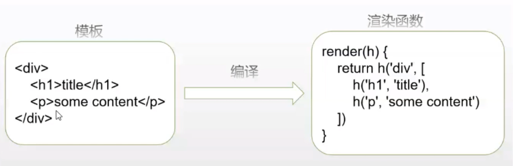

# day06-vue
## vue模板编译
模板编译的主要目的是**将模板（template）转换为渲染函数（render）**



## VUE 项目中一些最佳实践
### **如何封装svg**
```js
import Vue from 'vue';
import Icon from '@/components/icon.vue';

// 图标自动导入
// 利用webpack的require.context自动导入
// 返回的req是只去加载svg目录中的木模块中的函数
const req = require.context('./svg', false, /\.svg$/);

req.keys().map(req);

// 把Icon组件全局注册一下
Vue.component('Icon', Icon);
```
```html
<template>
    <svg :class="svgClass" aria-hidden="true" v-on="$listeners">
        <use :xlink:href="iconName" />
    </svg>
</template>

<script>
export default {
    name: 'Icon',
    props: {
        iconClass: {
            type: String,
            required: true
        },
        className: {
            type: String,
            default: ''
        }
    },
    computed: {
        iconName() {
            return `#icon-${this.iconClass}`
        },
        svgClass() {
            if(this.className) {
                return `svg-icon${this.className}`;
            }else {
                return `svg-icon`
            }
        }
    }
}
</script>

<style scoped>
.svg-icon {
    width: 1em;
    height: 1em;
    vertical-align: -0.15em;
    fill: currentColor;
    overflow: hidden;
}
</style>
```

### 项目配置

### 项目结构

### 权限控制 


