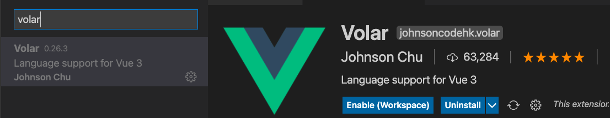
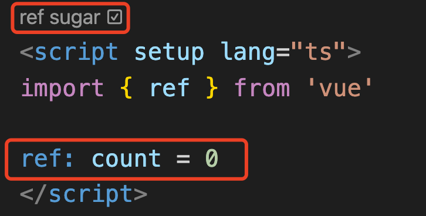
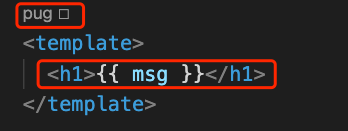
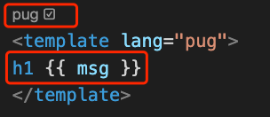
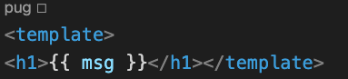
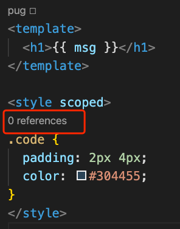
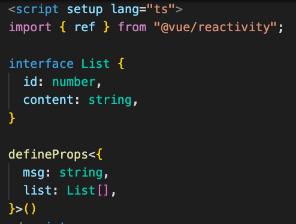
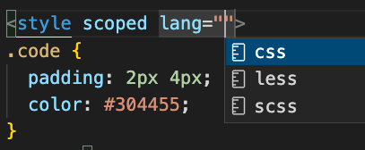
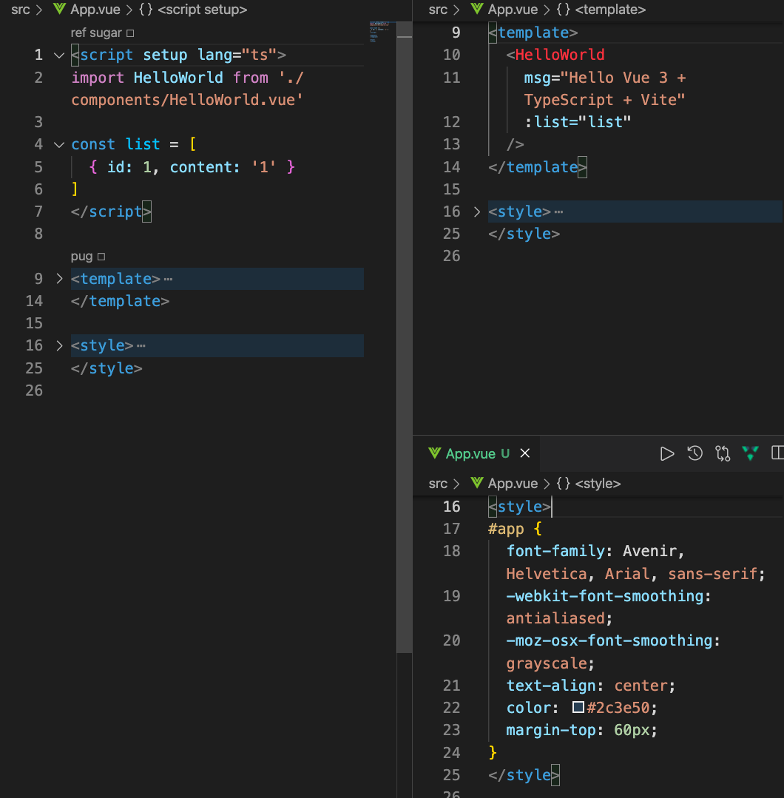

[toc]

# Volar 插件介绍

## 0. 前言

相信使用 `vscode` 和 `vue` 的同学对 `vetur` 这个插件一定不会陌生。

`ventur` 作为 `vue2.x` 的配套插件，主要用于对 `vue` 单文件组件提供语法高亮、语法支持以及语法检测。

但是，随着 `ts` 在社区组件火热，我们会发现，`ventur` 插件对于 `ts` 几乎没有支持，同时伴随着 `vue3` 和最近的 `vue3.2` 的出世，`vetur` 几乎已经不能支持 `vue` 单文件组件了，`ts` 自然是不支持的，但还有一些 `vue3` 的新特性，比如： `vue3` 的 `template` 不再需要写根标签了，`vetur` 却还是以前的配方。因此，伴随着 `vue3`，`volar` 插件也同时出世了。

## 1.  `volar` 是什么

在功能上 `volar` 和 `vetur` 是一致的，都是针对 `vue` 的插件，但是 `volar`  的功能却要强大得多

> 可以这样说， `volar`  是 `vue3` 的配套，`vetur` 是  `vue2` 的配套，所以，建议大家在使用的时候依据自己使用的 `vue` 版本来选择。

  

直接在 `vscode` 中搜索 `volar` 即可安装。

注意：

1. 在使用前需要禁用 `vetur` 以避免冲突
2. 推荐使用 `css/less/scss` 作为 `<style>`的语言，因为这些基于 `vscode-css-language` 服务提供了语言支持。如果你使用 `postcss/stylus/sass` 的话，你需要安装额外的语法高亮扩展。
   1. postcss: [language-postcss](https://marketplace.visualstudio.com/items?itemName=cpylua.language-postcss).
   2. stylus: [language-stylus](https://marketplace.visualstudio.com/items?itemName=sysoev.language-stylus)
   3. sass: [Sass](https://marketplace.visualstudio.com/items?itemName=Syler.sass-indented)

## 2. Volar 的新功能介绍

除了基本的 `vue` 单文件组件的语法高亮，`volar` 还有很多让人真香的功能，下面就让我们一起来看看都有哪些功能吧。

### 2.1 `ref sugar`

先来看一张图:

  &nbsp;&nbsp;&nbsp;&nbsp;
  

  

这里使用 `ref` 定义了一个 `count`，左边是我们普通的写法，注意看 `script setup` 上面的 `ref sugar`，当我点击这个 `checkbox` 后，就切换成了右边的写法了，自动为我们切换成了 `ref` 语法糖的写法了。这个 `checkbox` 还可以取消的，取消后就切换回普通的 `script setup` 的写法了。挺有意思吧！~

> 关于 ref 语法糖的大家可以去关注一下 vue 的 rfc，之前讨论得特别火热。

### 2.2 `template` 语法转换

再来看一张图： 

  &nbsp;&nbsp;&nbsp;&nbsp;
  

  

`vue` 中默认我们可以写两种 `template` 语法，一种是常用的 `html` , 一种是 `pug`， `pug` 的更加的精炼和简洁，但似乎大家用得不多，不知道是不是因为虽然简洁，但是却不直观的原因。

与 `ref sugar` 一样，`volar` 也为 `template` 提供了快捷的切换 `checkbox`，左边是 `html`，勾选上 `pug` 后为我们自动的装换成 `pug` 语法的模板，取消后转换回来，但似乎目前转换回来会有点问题，所以如果你不用的话，还是不要去点吧。

  
  
这是切换回来的模板，会有一些格式问题

  

### 2.3 `class references`

再来看图：

   &nbsp;&nbsp;&nbsp;&nbsp;
  

  

我们在 `style` 中所写的 `class` 是否有被引用，引用了几次，`volar` 插件都为我们安排得明明白白的，这样可以极快的发现哪些样式根本就没有被使用过，然后将其删除。

除此之外，在模板当中，鼠标 `hover` 到class 名上，显示 `Follw link(cmd+click)` ，意思是通过`cmd` 加上鼠标点击，就可以快速的跳转到对应的样式位置，这样就不用上线翻动或者 `cmd+f` 来查找了，真香。

  

  

### 2.4 `props` 类型检测

`vue2` 中无法实现对 `props` 的类型检测，只有当运行后才能有一个控制台的提示，同时还仅仅限于 `Number, String, Boolean, Array`，`volar` 插件配合 `ts` 完美的实现了 `props` 的类型检测，来看图。

  
   
 子组件中使用类型声明接收 msg 和 list props, 且必传 

  

  
  
 未传递 list props 时提示必传 

  
   
 类型传错是提示类型错误 

  

简直是太巴适了，完美的语法提示。并且，点击传递的 `props` 还可以实现跳转，这里演示不出来，大家可以试试看。

### 2.5 各种语法提示

还是看图说话吧我们：

#### 2.5.1 模板语法提示

   &nbsp;&nbsp;&nbsp;&nbsp;
  
模板中语法提示

  

`vue2` 中最我们比较头疼的一点是，在模板中使用变量是没有任何提示的，你只能凭借着记忆或者上下跳转查看才能在模板中写对应的字段，这一点在循环 `v-for` 中最能提现。`volar` 做到了，在模板中使用，再也不用担心我记不住对象的字段名字了。

#### 2.5.2 css module 语法提示

   &nbsp;&nbsp;&nbsp;&nbsp;

 

默认情况下，css module 在组件中维护了 `$style` 对象，使用时，也会有语法提示了

#### 2.5.3 `lang` 提示

   &nbsp;&nbsp;&nbsp;&nbsp;
  

  

这是 `script` 和 `style` 的 `lang` 提示。

### 2.6 编辑器三分天下

我相信 `vue` 最让人诟病的就是组件开发维护时的上下反复横跳，`script、style、template` 三者来回跳转个不停，真的最醉了。

`volar` 让我们得以三分天下，安装完 `volar` 插件后，编辑器右上角将出现这个图标。

   

  

在开发组件过程中，点击这个图标，你会发现，编辑器分成了三个部分，左侧是 `script`,右侧上方是`template`，右侧下方是 `style` ，分别呢其它的模块都自动折叠起来了，哇塞，真香，不说了，赶快用起来。

   
   

  

## 3. 总结

总结啥呀，不总结了，用尤大大的图来压阵吧！！

`vue3.2 + TS + volar` = 正香。

   

  

