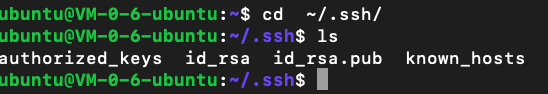

# 设置远程免密登录服务器
# 1. 生成自己的公钥
```bash
ssh-keygen -t rsa 
``` 
生成本机的公钥
生成的地址在生成的过程中可以看到

找到生成的公钥位置，其中的id_rsa.pub就是公钥，复制

## 2. 将公钥部署到服务器
进入自己的服务器
进入目录 
```bash
cd ~/.ssh/
vi authorized_keys
```
将复制的公钥拷贝到authorized_keys下，即完成


