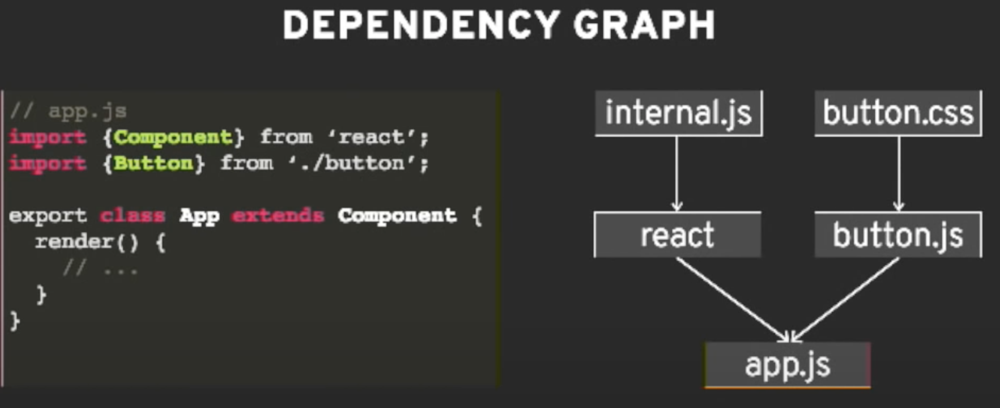

[toc]

# Build Your Own Webpack

[点击查看视频——Build your own Webpack (Live Coding an Ultra-simplified example of a Modern Module Bundler in JavaScript)
YGLF KYIV 2018](https://www.youtube.com/watch?v=Gc9-7PBqOC8)

## 1. WHAT IS A BUNDLER?
Bundlers let us write modules that work in the browser

### 1.1 ECMASCRIPT MODULES
```js
// this module depends on lodash
import _ from 'loadsh';

// this is what this module exposes
export default someValue;
```

### 1.2 COMMONJS
```js
// this module depends on lodash
const _ = require('loash');

// this is what this module exposes
module.exports = someValue;
```

### 1.3 DEPENDENCY GRAPH



###  1.4 IMPLEMENTATION OVERVIEW

1. Parse a asingle file and extract its dependencies
2. Recursively build a dependency graph
3. Package everything into a signle file
4. 