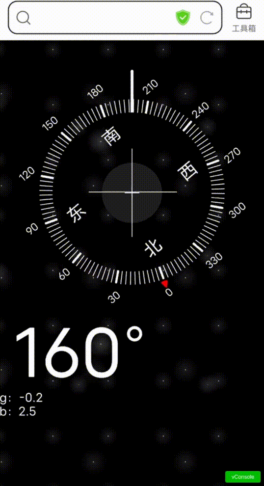

[toc]

# 玩转手机动作传感器

先来看几个捕获手机动作的好玩的例子吧：

1. OnePiece 骰子

   <div align='center'>
     
   </div>

2. 摇一摇

   <div align='center'>
     
   </div>

3. 指南针

   <div align='center'>
     
   </div>

## 1. 动作传感器

现在一般的智能手机都会内置陀螺仪和加速度传感器用于获取用户手机的动作数据。

在手机上，想要测量或绘制出手机运动的完整 3D 动作，就必须依靠陀螺仪，因为陀螺仪可以测量手机转动和偏转时的转动加速度，这样便可以精确分析出使用者的实际动作，然后根据动作，让手机做出相应的反应。

<div align='center'>
  
  <p>陀螺仪示意图</p>
</div>

Javascript 提供了两种事件来负责处理设备方向信息。

1. `DeviceOrientationEvent`

   当手机在方向上产生变化时触发。通过处理该事件传来的数据信息，让交互式地响应用户移动设备旋转和仰角变化成为可能。

2. `DeviceMotionEvent`

   当手机在各方向上的加速度发生改变时触发。`DeviceOrientationEvent` 监听的是方向的变化，`DeviceMotionEvent` 监听的是相应方向上加速度的变化。

## 2. 监听方向 —— deviceorientation

### 2.1 坐标系

在了解如何获取手机方向之前，先来看看手机坐标系

<div align='center'>
  
  <p>手机坐标系</p>
</div>

- x 轴沿着屏幕表面，向右为正，向左为负
- y 轴沿着屏幕表面，向上为正，向下为负
- z 轴垂直屏幕表面或键盘，远离屏幕的方向为正

手机方向信息就是指手机在**某一个给定轴上的旋转量。**

### 2.2 基本使用

要接收手机方向变化的信息，只需要监听 `deviceorientation` 事件即可

```js
window.addEventListener(
  "deviceorientation",
  (DeviceOrientationEvent) => {},
  true
);
```

回调函数会定期地接收到最新的手机方向事件对象：`DeviceOrientationEvent`，这个对象上包含了以下四个值：

- `alpha`

  表示手机在 z 轴上的旋转角度，范围为 0°~360°。`alpha` 为 0° 时表示手机的顶部正指北极方向，当手机向左旋转时，`alpha` 将增大。

- `beta`

  表示手机在 x 轴上的旋转角度，范围为 -180°~180°。 `beta` 为 0° 时表示手机顶部和底部距离地表面高度是一样的，当设备向前旋转时，`beta` 递增到 180°，向后翻转递减到 -180°。

- `gamma`

  表示手机在 y 轴上的旋转角度，范围为-90°~90°。`gamma` 为 0° 表示手机左右两边距离地表面高度是一样的，当设备向右旋转时，`gamma` 递增到 90° ，向左翻转时，递减到 -90°。

- `absolute`

  一个布尔值，表示手机是否能够探测到地球坐标系

<div align='center'>
  
  
  
  <div style="font-size: 14px">图1：手机向左旋转，alpha 将增大</div>
  <div style="font-size: 14px">图2：手机向前旋转，beta 将增大</div>
  <div style="font-size: 14px">图3：手机向右旋转，gamma 将增大</div>
</div>

### 2.3 示例——横竖屏监测

横竖屏主要用 beta 和 gamma 值来判定：

- 可设定：当 gamma 值在 45°~90° 或 -45°~-90° 之间并且 beta 值 -30°~30° 之间时**切换**为横屏（同时满足切换）
- 可设定：当 gamma 值在 45°~90° 或 -45°~-90° 之外（及 -45°~45°）并且 beta 值 -30°~30° 之外（即：30°~180 ° 或 -180°~-30°）时**切换**为竖屏（同时满足切换）
- 否者保持现状

> 至于为何如此判定，大家可以自行探究一下便知

<div align='center'>
  
</div>


核心代码如下，[点击可查看详细源码](https://github.com/zhangpaopao0609/web-study-record/tree/master/%E9%9B%B6%E6%95%A3%E7%9A%84%E7%9F%A5%E8%AF%86%E7%82%B9/%E6%89%8B%E6%9C%BA%E4%BC%A0%E6%84%9F%E5%99%A8/H5-gyroscope/02-deviceorientation-v-h)

```js
function handleOrientation(event) {
  const beta = event.beta;
  const gamma = event.gamma;

  const betaBetween = beta >= -30 && beta <= 30;
  const gammaBetween = gamma >= -45 && gamma <= 45;
  if (!gammaBetween && betaBetween) {
    now.innerHTML = "横屏";
    Horizontal();
  } else if (gammaBetween && !betaBetween) {
    now.innerHTML = "竖屏";
    Vertical();
  }
}

window.addEventListener("deviceorientation", handleOrientation);
```

## 3. 监听加速度 —— devicemotion

### 3.1 基本使用
要接收手机在各方向上位置和方向的变化速度，只需要监听 `devicemotion` 事件即可

```js
window.addEventListener("devicemotion", (DevicemotionEvent) => {});
```

回调函数会定期地接收到手机最新的方向事件对象：`DeviceOrientationEvent`，这个对象上包含了以下四个值：

- `acceleration`

  一个包含手机在 X Y Z 三个轴上加速度的对象， 值的单位为 [m/s²](https://en.wikipedia.org/wiki/Meter_per_second_squared)：`{x: value, y: value, z: value}`

- `accelerationIncludingGravity`

  一个包含手机在 X Y Z 三个轴上受到引力影响的加速度的对象，值的单位为 [m/s²](https://en.wikipedia.org/wiki/Meter_per_second_squared)：`{x: value, y: value, z: value}`

- `rotationRate`

  一个包含手机在 alpha、beta 和 gamma 三个方向上加速度的对象，值的单位为度每秒：` {alpha: value, beta: value, gamma: value}`

- `interval`

  表示从设备获取数据的时间间隔的数字，值的单位为毫秒。

### 3.2 示例 —— 摇一摇

核心代码如下，[点击可查看详细源码](https://github.com/zhangpaopao0609/web-study-record/tree/master/%E9%9B%B6%E6%95%A3%E7%9A%84%E7%9F%A5%E8%AF%86%E7%82%B9/%E6%89%8B%E6%9C%BA%E4%BC%A0%E6%84%9F%E5%99%A8/H5-gyroscope/04-devicemotion-shake)

> ios 系统需要向用户申请权限，在源码中有展示

```js
function gotoShake() {
  const threshold = 10;
  let xBefore = 0; // 记录上一次 x 轴方向的加速度
  let yBefore = 0; // 记录上一次 y 轴方向的加速度
  let zBefore = 0; // 记录上一次 z 轴方向的加速度

  function handleShake(devicemotionEvent) {
    const { x, y, z } = devicemotionEvent.acceleration; // 当前 x y z 轴的加速度
    const inX = Math.abs(x - xBefore); // 本次加速度与上一次加速度差值
    const inY = Math.abs(y - yBefore);
    const inZ = Math.abs(z - zBefore);
    xBefore = x;
    yBefore = y;
    zBefore = z;
    const isShaking = inX > threshold || inY > threshold || inZ > threshold; // 只要有一个差值超过阈值，则说明正在摇一摇
    if (isShaking) {
      handleShaking(); // 调用摇动处理函数
      startVibrate(); // 调起手机震动
    } else {
      handleStop();
    }
  }

  window.addEventListener("devicemotion", throttle(handleShake, 200), true);
}
```

## 4. 资源

1. 本文示例源代码
   - [H5-gyroscope](https://github.com/zhangpaopao0609/web-study-record/tree/master/%E9%9B%B6%E6%95%A3%E7%9A%84%E7%9F%A5%E8%AF%86%E7%82%B9/%E6%89%8B%E6%9C%BA%E4%BC%A0%E6%84%9F%E5%99%A8/H5-gyroscope)
2. 参考文献

   - [Detecting device orientation](https://developer.mozilla.org/en-US/docs/Web/Events/Detecting_device_orientation)

   - [Orientation and motion data explained](https://developer.mozilla.org/en-US/docs/Web/Events/Orientation_and_motion_data_explained)

   - [Window: deviceorientation event](https://developer.mozilla.org/en-US/docs/Web/API/Window/deviceorientation_event)
   - [How do I get DeviceOrientationEvent and DeviceMotionEvent to work on Safari](https://stackoverflow.com/questions/56514116/how-do-i-get-deviceorientationevent-and-devicemotionevent-to-work-on-safari)

## 5. 总结

偶来尝试，没想还挺有意思的。
一直以来都觉得硬件是真的很有魅力，要想捕获手机的动作，底层硬件不支持的话，都是白搭。
但如果硬件支持了，软件不加以利用，不也是白搭嘛！
所以呀，硬件是骨骼，软件是血液，加以利用，必有奇效，说来微信不就是典型的例子嘛！
