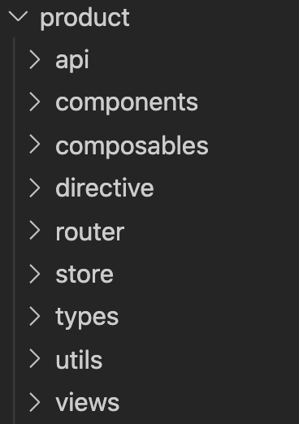

[toc]

# “四不像” 项目要如何进化？大型 SPA、多仓还是单仓？ 

> 人类在意识和欲望的推动下得以不断进化，朝着远方大踏步前行；程序的世界也因此更迭不断，可那些 “古老” 的项目却依旧墨守成规，不知如何进化。

  

## 1. 什么？

一直在持续维护一个项目，因为历史原因，目前这个项目既不是一个纯粹的大型 SPA 项目、不是多仓更不是单仓，更像是上古神兽 “混沌”——四不像，所以称呼它为 “四不像” 项目，至于为什么这么说，请往下看。

**为梳理和阅读方便，下面就称这个项目为：混沌**

首先来看看目前这个仓库（脱敏后）：

  
  
  
  

    图1：“混沌” 项目的目录结构
  

  

    左图：项目根目录，其中 src 为主入口，同时还存在 4 个子项目
  

  

    右图：子项目 2 的目录结构，可以看到是一个较完整的项目目录，其余子项目结构完全一致
  

> **每一个子项目在产品侧相当于一个大功能，在页面上表现为一个菜单栏下的所有功能**。

为何是 “四不像”：

1. 不是一个纯粹的大型 SPA 项目

   大型的 SPA 项目并不应该如此般设计，一起来看看社区推荐的最佳实践：

   

     
     
     
     

       图2：社区推荐的大型 SPA 项目目录结构最佳实践
     

     

       左图： 整个项目仅存 src， src 作为项目的主入口，包含了项目的所有业务代码
     

     

       右图：在 api、router、store 以及 views 中分模块地（modules）实现业务代码
     

   

   ​	如果抛开子项目来说，“混沌” 是一个简单的 SPA 项目，参照社区最佳实践，如果把这些子项目**按模块拆分**到 src 下，那么这个项目就可以称为一个大型的 SPA 项目，可它却并没有。

2. 不是多仓

   这一点毋庸置疑。但是从各子项目的目录结构来**猜测**，当初建立这个仓库的作者或许是希望这个仓库能够发展成多仓的，因为就图 1 右图子项目的目录来看，每一个子项目都是一个完整的 SPA  项目目录，相应的将 “混沌” 抽离成多仓也较容易。

3. 不是单仓

   单仓通常是指一个仓库中包含多个不同的项目，且项目之间具有良好的关系。从项目结构上来看，“混沌” 的确是由多个不同项目组合合成，但是这几个项目之间的关系却 **“不一般”**。

   - 单入口，所有项目均依赖 src 主入口访问

   - 项目不能独立运行、独立部署
   - 各项目交织严重（交叉引用）

   因此， O2 不能称为单仓

   > 关于单仓，[点击可查看详细的说明]([A monorepo is a single repository containing multiple distinct projects, with well-defined relationships.](https://monorepo.tools/#source-code-sharing))

## 2. 怎么了？

维护了 “混沌” 将近一年，需求的开发没有出现过延期，上线后也没什么大问题，听起来似乎还行呀，可真的是如此吗？

1. 代码交织严重

    src 引用 product 中 utils 下的方法，way 引用 skill 中 components 下的组件。没有一个清晰的目录结构、每个子项目下都拥有 utils compoents 等以及开发人员的更迭等原因使得这一情况越来越严重。

2. 代码重复率高（复用率低）

   不同的团队负责不同的模块需求，不知道某个方法或组件是否在其它子项目中已经开发过，所以每个团队都会去自己去开发，这导致：

   - 时间人力的浪费
   - 稳定性降低

3. 项目需要分模块部署

   “混沌” 目前的模式完全无法支持分模块部署

4. 构建等待时间长

5. 接手成本高

## 3. 那咋办呢？

那 “混沌” 要如何才能得见清明呢？

既然 “混沌” 是四不像，那就朝着某一类进化吧！

### 3.1 大型 SPA

参照社区推荐的最佳实践，把 “混沌” 改造成大型的 SPA，可这并非银弹：

1. 优势
   - 改造简单，仅需要将所有子项目按模块移到 src 下即可
   - 项目结构简单清晰，学习成本低，上手难度低
   - 代码复用简单，全局公共方法和组件
   - 依赖版本统一，便于管理
   - 仅需一套 CI

2. 劣势
   - 项目巨大，构建慢
   - 依赖升级所造成的影响面广
   - 模块未独立，无法实现模块独立运行、独立开发和独立部署
   - commit 混乱（相较多仓）
   - 仅支持同一技术栈

3. 思考
   - 构建慢 —— 依赖构建 cache 解决
   - 一个稳定的项目，依赖升级的理由是？—— 除非真的有必要，否则升级的性价比太低
   - 模块是否真的需要独立部署吗？—— 看产品形态
   - commit 混乱 —— 分支规范可以解决
   - 同一技术栈 —— 既然是一个同一个大团队，为何使用不同技术栈（除非项目庞大无比）

### 3.2 多仓

就目前 “混沌” 的项目结构来看，改造成多仓相当容易，可这同样并不能解决所有问题：

1. 优势

   - 改造简单，仅需要将所有子项目拆成单独仓库即可

   - 每个仓库代码量低，构建快，结构清晰，上手难度低

   - 每个仓库可自行升级依赖版本（某种程度上是优势）

   - 每个仓库可使用不同技术栈

   - commit 清晰

   - 天然支持独立运行、独立开发、独立部署

2. 劣势

   - 要如何保证产品的整体性呢？

   - 代码复用较难（相较于大型 SPA）

   - 依赖版本无法统一管理

   - 需要多套 CI

3. 思考

   - 产品的整体性

     从用户的体验上来说，产品的整体性，也就是使用产品时的流畅度（切换菜单栏时不会重新拉取、刷新页面）。

     由多仓形式组合成一个整体的产品，一般采用两种模式：

     - MPA ，MPA 非常的简单，但是不能保证产品的整体性，它仅仅只是把不同站点生硬地拼凑起来了

     - Single-SPA，或者说微前端，这种模式除了能够很好的保证产品的整体性外，还能够解决诸如代码复用等问题

       > 但微前端也非银弹，解决问题的同时它也会带来麻烦。[点击查看详细的阐述](#) (还没写，写完了贴上)

   - 代码复用 —— 组件库、公共方法库能够一定程度上解决代码复用，但是如何维护却又是另一个问题

   - 依赖版本管理 —— 这既是优势，也是劣势

   - 多套 CI —— 命令、流程和工具的统一

### 3.3 单仓

单仓的讨论在业内可谓热火朝天，谷歌微软等巨头对此推崇至极，但它就是完美的吗？

1. 优势

   - 代码复用简单
   - 代码全部可见，开发者均可学习和修改（真正的全员协作）
   - 子项目可独立运行、独立部署
   - 子项目代码量低，结构清晰，上手难度低

   - 依赖版本统一，便于管理

   - 一套 CI

2. 劣势
   - 如何保证公共方法、组件更新后项目的可靠性
   - 如何保证其它开发者擅自修改代码
   - 如何解决单仓体积过大
   - 依赖升级所造成的影响面广
   - 如何保证产品的整体性

3. 思考

   - 更新公共服务后的可靠性
     - 目前行业内已经有非常多且好用的便捷构建单仓的工具比如 Bazel，当组件或方法更新时， Bazel 能够清晰的指出所影响的文件和代码，开发者可参照此修改
     - 需要完整的、自动化的单元测试

   - 修改代码
     - 权限管理，包括查看代码权限、合并代码权限
     - 开发规范和合并代码规范
   - 单仓体积大
     - 如果体积真的过大，可以采用虚拟文件或远程开发，谷歌采用的就是远程开发模式
     - 一般如 “混沌” 这种项目，并不会大到无法承受，而且仅需一次 clone 
   - 依赖升级 —— 依赖工具的检测和自动化测试保证

   - 产品整体性 —— 如果把 “混沌” 改造成单仓，再由单仓中的子项目组合成一个产品，为了保证产品的整体性，同样可以引入微前端

## 4. 所以呢？

说了这么多，那到底怎么选呀！！给个准确信儿涩！！

古人常说因地制宜，因材施教，就是告诉我们做决定时要依情形而定，不可一杆定型。诸如 “混沌” 这样的项目，更是不可一刀切，结合第 3 节，在这里得出总结：

> 以下总结为个人观点，仅供参考

在此之前，请先**认认真真**思考考以下四个问题？这四个问题将决定适合何种模式！

1. 请问，无论产品形态如何发展，在未来，产品的各个模块是否需要**独立部署**？
2. 请问，开发此产品的团队是否需要使用**不同技术栈**？
3. 请问，开发过程中使用的依赖是否会进行**大版本升级**（破坏性升级）？
4. 请问，团队的基础建设是否完备？包括但不限于开发流程规范、公共服务单测能力、虚拟或远程开发能力、部署能力、构建能力。

### 4.1 新项目

1. 如果第 1、2 和 3 个问题的答案**都是否定的**，那么直接选择大型 SPA 即可。

   完全没有必要使用多仓或者大仓，只需要解决 3.1 中提到的大型 SPA 存在的问题即可。

2. 如果第 1 个问题的答案是**肯定的**，那么就需要考虑选择多仓还是单仓，才能够解决问题。

   那么，此时又该如何选择呢？就需要看第 4 个问题的答案了：

   - 第 4 个问题的答案**是否定的**，那么此时就应该选择多仓（没有完备的基础建设的单仓就是一堆垃圾山）

     针对 3.2 提出的多仓的劣势进行解决，比如组件库，引入**微前端**

   - 反之，毫不犹豫的选择单仓

3. 至于第 2 或 3 个问题的答案是**肯定的**情形，需要认真的衡量，因为在新项目中这两条并不一定需要的。

   > 当然，大部分情况下第 2 或 3 的答案都是否定的

### 4.2 旧项目改造 

> 这里讨论的是诸如 “混沌” 这样的项目

旧项目的改造和新项目最大的不同点就是，旧项目的改造成本是非常高的，改造前是需要衡量性价比的。

1. 如果第 1 个问题的答案是**肯定的**，那么没有办法，只能考虑改造成多仓或单仓

   选择单仓还是多仓参考 4.1 的第 2 点。 

2. 如果第 1 个问题的答案是**否定的**，但是第 2 或 3 个问题的答案是**肯定的**，也就是项目中使用了非常过时的技术，那么此时就需要衡量以下两种方式的性价比哪一种更高。

   - 将项目改造成多仓或单仓，同时引入微前端
   - 就旧项目直接重构成新项目

## 5. 还有吗？

都说，程序的世界是没有银弹可言的，还真是。

SPA、多仓和单仓，哪一个没有自己的优势呀，又有哪一个没有自己的劣势呀。那句 “没有最好的，只有适合自己的” ，在这里真的是被展现得淋漓尽致。你的项目适合哪一种模式只有你知道哟！！

去思考、去探索、去实践！！

参考链接：

1. [Everything you need to know about monorepos, and the tools to build them.](https://monorepo.tools/)
2. [vue-element-admin](https://github.com/PanJiaChen/vue-element-admin)