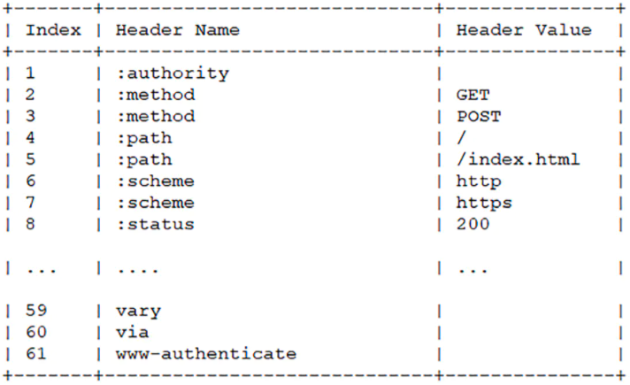

[toc]

# HTTP2.0的改进

由于 HTTPS 在安全方面已经做得非常好了，HTTP 改进的关注点放在了性能方面。主要区别有：

| feature            | description                                                                   |
| ------------------ | ----------------------------------------------------------------------------- |
| 头部压缩           | Hpack + 哈夫曼编码压缩                                                        |
| 多路复用           | 报文转为二进制，生成 steam 在 tcp 乱序传输，但是同一个 Stream ID 的帧有序传输 |
| 服务器推送         | 新建"流"主动向客户端发送消息                                                  |
| 可以设置请求优先级 |                                                                               |

## 1. 头部压缩

HTTP 1.1 有着对请求体的压缩 `Content-Encoding`

```bash
// 发送端
Content-Encoding: gzip
// 接收端
Accept-Encoding: gzip
```

但是报文的另一个组成部分 —— `Header` 却被五十了，没有针对它的优化手段。

- 当请求字段非常复杂的时候，尤其对于 GET 请求，请求报文几乎全是请求头，这个时候还是存在非常大的优化空间的。
- 成千上万的请求响应报文里有很多字段值都是重复的，非常浪费，"长尾效应"导致大量带宽消耗在了这些冗余度极高的数据上。

HTTP2 针对头部字段，也采用了对应的压缩算法 —— HPACK,对请求头进行压缩。

1. 废除了原有的起始行概念

   为了方便管理和压缩，HTTP/2废除了原有的起始行概念。

   把起始行里面的请求方法、URI 、状态码等统一转换成了头字段的形式，并且给这些"不是头字段的头字段"起了个特别的名字 —— "伪头字段"（pseudo-header fields）。而起始行里的版本号和错误原因短语因为没什么大用，顺便也给废除了。

   为了与"真头字段"区分开来，这些"伪头字段"会在名字前加一个 ":"，比如 ":authority",":method",":status"，分别表示的是域名、请求方法和状态码。

   现在 HTTP 报文头就简单了，全部都是"Key-Value"形式的字段。

2. 在服务器和客户端之间建立哈希表

   将用到的字段存放在这张表中，那么在传输的时候对于之前出现过的值，只需要把索引（比如0， 1， 2， ... ）传给对方即可，对方拿到索引查表就行了，这种传递索引的方式，可以说让请求头字段得到极大程度的精简和复用。

   

3. 对于整数和字符串进行哈夫曼编码

   哈夫曼编码的原理就是先将所有的出现的字符建立一张索引表，然后让出现次数多的字符对应的索引尽可能短，传输的时候也是传输这样的索引序列，可达到非常高的压缩率。

头部数据压缩之后，HTTP2就要把报文拆成二进制的帧准备发送。

## 2. 多路复用

### 2.1 什么是 HTTP 队头阻塞？

HTTP 队头阻塞的问题，其根本原因在于 HTTP 基于请求 - 响应模式，在同一个 TCP 长连接中，前面的请求没有得到响应，后面的请求就会阻塞。当然这可以通过并发连接和域名分片的方式解决一部分问题，但这并没有真正从 HTTP 本身的层面解决问题，只是增加了 TCP 连接，分摊风险而已。而且这么做也存在弊端，多条 TCP 连接会竞争有限的带宽，让真正优先级高的请求不能优先处理。

而 HTTP2 便从 HTTP 协议本身解决了队头阻塞问题。注意，这里并不是指的 TCP 队头阻塞，而是 HTTP 队头阻塞，两者并不是一回事。 TCP 的队头阻塞是在数据包层面，单位是数据包，前一个报文没有收到便不会将后面的报文上传给 HTTP，而 HTTP 队头阻塞是在 HTTP 请求-响应层面，前一个请求没处理完，后面的请求就要阻塞住。两者所在的层次不一样。

那么 HTTP2 如何来解决所谓的队头阻塞呢？

### 2.2 二进制分帧

首先，HTTP2认为明文传输对机器而言太麻烦了，不方便计算机的解析，因为对于文本而言有多义性的字符，比如回车换行到底是内容还是分隔符，在内部需要用到状态机去识别，效率比较低。于是 HTTP2 干脆把报文全部换成二进制格式，全部传输 01 串，方便机器的解析

原来的 Headers + Body 的报文格式如今被拆分成了一个个二进制的帧，用 Header 帧存放头部字段，Data 帧存放请求体数据。分帧之后，服务器看到的不再是一个个完整的 HTTP 请求报文，而是一堆乱序的二进制帧。这些二进制帧不存在先后关系，因此也就不会排队等待，也就没有了 HTTP 的队头阻塞问题。

通信双方都给对方发送二进制帧，这种二进制帧的双向传输的序列，也就做流（stream），HTTP2用流来在一个 TCP 连接上来进行多个数据帧的通信，这就是多路复用的概念。

这里有一个疑问，既然是乱序齐发，那最后如何来处理这些乱序的数据帧呢？

首先声明的是，所谓的乱序，指的是不同的 ID 的 stream 是乱序的，但同一个 stream ID 的帧一定是按顺序传输的。二进制帧叨叨后对方会将 Stream ID 相同的二进制帧组装成完整的请求报文和响应报文。当然，在二进制帧当中还有其它的一些字段，实现了优先级和流量控制等功能。

## 3. 服务器推送

HTTP2还在一定程序上改变了传统的 "请求-应答"工作模式，服务器不再是完全被动地响应请求，也可以新建"流"主动向客户端发送消息。比如，在浏览器刚请求 HTML 的时候就可以提前把可能会用到的 JS,CSS文件发给客户端，减少等待的延迟，这被称为 "服务器推送"（Server Push）

## 4. 详细介绍一下 HTTP2 的多路复用

HTTP/2的多路复用（Multiplexing）是该协议的核心特性之一，它允许在单个TCP连接上同时发送多个请求和响应，而不需要按顺序一一等待前一个完成。这显著提高了网页加载的效率和速度，解决了HTTP/1.x中存在的“队头阻塞”问题。

在HTTP/1.x中，浏览器对于同一域名通常会限制同时打开的连接数（通常是6个）。这意味着如果有多个资源需要加载，浏览器会创建多个TCP连接，或者在一个连接上排队等待前一个请求完成。这导致了延迟和资源的低效利用。

HTTP/2通过以下方式实现多路复用：

1. **帧（Frames）**：HTTP/2将所有传输的信息分割成更小的消息和帧，并且它们可以交错发送。帧是HTTP/2通信的最小单位，每个帧都包含帧头，其中包括流标识符，表明它属于哪个流。

2. **流（Streams）**：流是一个建立在TCP连接之上的虚拟通道，可以承载双向的消息。每个流都有一个唯一的标识符。单个TCP连接可以有多个同时打开的流，而每个流都可以承载一条或多条消息。

3. **消息（Messages）**：消息是指逻辑上的HTTP消息，例如一个完整的请求或响应。消息由一个或多个帧组成。

4. **头部压缩（Header Compression）**：HTTP/2引入了HPACK压缩格式，用于减少头部大小，进一步提高传输效率。

多路复用的工作原理是，**客户端和服务器可以将HTTP消息分解为独立的帧，然后交错发送这些帧，最后在另一端重新组装起来。由于每个帧都有流标识符，所以即使它们是交错发送的，接收方也能够将它们正确地关联到各自的流上**。

这种方式允许单个连接上的多个请求和响应几乎同时进行，而不会互相阻塞。例如，如果一个大的文件正在传输，而同时又有一个新的请求发起，新请求的帧可以在大文件的数据帧之间穿插发送，而不需要等待大文件传输完成。

多路复用使得HTTP/2能够更有效地使用TCP连接，减少了延迟，提高了页面加载速度，并允许更复杂的请求优先级设置。这对于提升用户体验和网站性能有着显著的影响。
