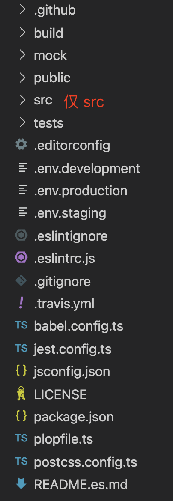

# 守护世界守护你 —— 我该如何进化？

> 人类在意识和欲望的推动下得以不断进化，朝着远方大踏步前行；程序的世界也因此更迭不断，可那些 “混沌” 项目却依旧踟蹰不前，不知如何进化。

  

**主持人跑跑**：欢迎屏幕前的各位观众朋友，欢迎走进技术创新中心的大型情感节目《守护世界守护你》，本节目由《爱跑爱生活》特约播出。节目的开始先来看看今天请到的两位技术兼情感导师是谁，他们分别是项目分析大师 CC，欢迎 CC 老师，行业解决方案专家 Hub，欢迎 Hub 老师。来，让我们掌声请出今天的嘉宾：

**嘉宾混沌**：大家好，跑跑老师好，CC 老师和 Hub 老师好！

**主持人跑跑**：你好，可以先跟大家做一下自我介绍吗？

**嘉宾混沌**：好的。我叫混沌，今天一年零六个月零两天大了，名字是我出生那天主人给我起的，我是一个 toB 平台的前端项目，目前定居在 git 单身公寓，我所有的一切都是我主人给我的，我很喜欢我的主人。刚开始的时候，只有主人一个人会来给我投食，而且还会给我做美容，比如哪里重复了，他都会好好的帮我整理的，我也好开心，那时候我可美了，干干净净的，大家可以看看，这就是我那时候的照片：

  
  
图1：我曾经的样子

**主持人跑跑**：的确漂亮！

**台下观众1**：哇！！

**台下观众2**：这假的吧！

**嘉宾混沌**：我知道，大家可能不相信，别说你们不信了，我自己都不敢相信原来我也这么美丽过，对了，屏幕前的观众朋友可能看不到我现在的样子，我也把照片放出来吧。

   

   
     
图2：我现在的样子

左图：项目根目录，其中 src 为主入口，同时还存在 4 个子项目
     

右图：子项目 2 的目录结构，可以看到是一个较完整的项目目录，其余子项目结构完全一致

**嘉宾混沌**：这就是我现在的样子，我知道，我现在不好看了。除了 src 外，还有很多的子项目相互杂糅，src 和子项目之间、子项目和子项目之间也没有很好的交互关系。每一个子项目在产品侧相当于一个大功能，在页面上表现为一个菜单栏下的所有功能。

**台下观众**：一顿惋惜之声

**主持人跑跑**：那可以跟我们讲讲吗？我想大家都想知道你到底经历了什么。

**嘉宾混沌**：嗯。。（掩面哭泣，主持人递上纸巾）。谢谢跑跑老师，从去年开始，就不只是主人一个人给我投食了，还有很多他的同事，而且每天都好多好多，有时候还有很些重复的食物呢，我不是不吃重复的东西，是吃了担心自己会变成主人的负担，还有，主人也不再给我做美容了。我知道的，是主人真的太忙了，抽不出那么多的时间了，有次主人他们晚上很晚了还在工作呢，我都记着的，所以我理解的，我不怪我主人的，我知道主人是永远爱我的。这样的状况持续了将近一年时间，我就成了现在的样子，不过我一直相信我主人不会放弃我的。直到最近，主人告诉我，混沌呀，最近没有那么忙碌了，我想好好的给你改造改造，给你美容瘦身哈，但是你稍微给我点时间哈，我得找个最合适你的方案，我得好好想想。

**主持人跑跑**：原来是这样的，看来你真的有个好主人呀！

**嘉宾混沌**：嗯嗯，是的，所以我也想出一份力，不想主人为了我那么操心。今天来到现场，就是想请教各位老师，我应该怎样进化呢，我自己真的不知道，但是我又好想帮我主人，这样主人就可以多休息一下了，谢谢各位老师。

**主持人跑跑**：你也有心了，所以你是希望各位老师帮你指出你的问题，然后再为你找出解决方案是吗？这样你就能帮到你主人了！

**嘉宾混沌**：是的是的！谢谢跑跑老师！！

**主持人跑跑**：那你就来对了，今天请到的两位老师都是咱们增长中台顶级的专家，相信他们一定能解决你的困惑的。题面就摆在这儿了，来吧各位老师，难题交给你们，一起进入丘比特问卷。

**CC 老师**：说实在的，我应该算是见过很多的项目的了，各种各样的都有，随着体量的增长和团队的扩张，像你这样的情形的，我见过很多，但是，我从来没有见过一个项目它觉得主人太累了，想要帮助主人，你真的很棒，我觉得应该给你掌声。

**台下观众**：哗啦啦的掌声

**主持人跑跑**：屏幕前的你是不是也可以点个赞呢！！

**CC 老师** ：那我们就来谈谈你吧，在我看来呀，你现在的状况有些复杂，你既不是一个纯粹的  SPA 项目，也不是多仓，更不是单仓了，为什么这么说呀，听我细细道来：

1. 不是一个纯粹的大型 SPA 项目
   大型的 SPA 项目并不应该如此设计，一起来看看社区推荐的最佳实践：

   

   
     
图3：社区推荐的大型 SPA 项目目录结构最佳实践

左图： 整个项目仅存 src， src 作为项目的主入口，包含了项目的所有业务代码
     

右图：在 api、router、store 以及 views 中分模块地（modules）实现业务代码

其实如果抛开子项目来说，你是一个简单的 SPA 项目，参照社区最佳实践，如果把这些子项目**按模块拆分**到 src 下，那么你就可以摇身一变，成为一个大型的 SPA 项目。

2. 不是多仓
   这一点毋庸置疑。但是我从你的各子项目的目录结构来**猜测**，我个人猜测哈，当初你主人建立这个仓库的时候或许是希望这个仓库能够发展成多仓的，因为从你的子项目目录来看，就图 1 右图，每一个子项目都是一个完整的 SPA  项目目录，相应的把你改造成多仓也较容易。

3. 不是单仓
   单仓通常是指一个仓库中包含多个不同的项目，且项目之间具有良好的关系。从项目结构上来看，你的确是由多个不同项目组合合成，但是如你所说，这几个子项目之间的关系却 **“不一般”**。

   - 单入口，所有项目均依赖 src 主入口访问

   - 项目不能独立运行、独立部署
   - 各项目交织严重（交叉引用）

   关于单仓，大家可查看详细的说明，我这里就不多说了。

   > [A monorepo is a single repository containing multiple distinct projects, with well-defined relationships.](https://monorepo.tools/#source-code-sharing)

**嘉宾混沌**：嗯，您说得很对 CC 老师，我自己其实也有这样的感受，有时候我也会跟我们 git 单身公寓的朋友比较，我发现我和它们都不一样。但是，从我出生到现在，主人所有的需求开发没有出现过延期，上线后也没什么大问题的。

**CC 老师**：嗯嗯，我也相信，你这么体贴，你的主人也那么优秀，相信是不会影响业务的，但是真的是如此吗？还有，除了业务，你的主人和他的同事们给你投食时他们开心吗？体验好吗？我想，简单的给你说说你存在的问题吧：

1. 代码交织严重
   我发现你的 src 引用了 product 中 utils 下的方法，way 引用了 skill 中 components 下的组件。你没有一个清晰的目录结构、每个子项目下都拥有 utils compoents 等，而且，可以预见的是，如果不做出改变，随着人员的更迭，这一情况还会越来越严重。

2. 代码重复率高（复用率低）
   不同的团队负责不同的模块需求，不知道某个方法或组件是否在其它子项目中已经开发过，所以每个团队都会去自己去开发，这会导致：

   - 你主人和他同事们时间、精力的浪费
   - 还会降低业务的稳定性

3. 你现在完全无法支持分模块部署

   如果哪天你主人接到需要分模块部署的需求，以你现在的模式，是无法支持的

4. 你现在体积这么大，构建等待时间长，给你投食的人体验会不好的

5. 你现在结构不清晰，除了你主人完全了解你以外，其他人想要完全了解你，学习成本好高的

**主持人跑跑**：谢谢 CC 老师的点评， CC 老师真的很细心，想到了方方面面，从业务的稳定到人员的体验，均给我们的混沌指出了问题，相信混沌听完后也感同身受吧！

**嘉宾混沌**：是的是的，谢谢 CC 老师，那我该怎么做呢？我真的很想帮我主人

**主持人跑跑**：不用着急，我想 Hub 老师早已迫不及待了 Hub 老师您请：

**Hub 老师**：的确是有些迫不及待了，因为就像 CC 老师说的那样，你真的很难得，这么为主人着想的真的很少见，所以我也希望自己能出一份力，帮到你。那话不多说，那有哪些方案可以提供给你呢？我想，既然你不是社区常见的三种模式，那是不是可以朝着某一类进化呢！

**1. 大型 SPA**

   参照社区推荐的最佳实践，你可以进化成大型的 SPA，可这并非银弹：

   a. 它的优势是

	   - 改造简单，仅需要将所有子项目按模块移到 src 下即可

	   - 项目结构简单清晰，学习成本低，上手难度低

	   - 代码复用简单，全局公共方法和组件

	   - 依赖版本统一，便于管理

	   - 仅需一套 CI

   b. 它的劣势是

	   - 项目巨大，构建慢

	   - 依赖升级所造成的影响面广

	   - 模块未独立，无法实现模块独立运行、独立开发和独立部署

	   - commit 混乱（相较多仓）

	   - 仅支持同一技术栈

   c. 我的思考是

	   - 构建慢 —— 依赖构建 cache 解决
	   - 一个稳定的项目，依赖升级的理由是？—— 除非真的有必要，否则升级的性价比太低
	   - 模块是否真的需要独立部署吗？—— 看产品形态
	   - commit 混乱 —— 分支规范可以解决
	   - 同一技术栈 —— 既然是一个同一个大团队，为何使用不同技术栈（除非项目庞大无比）

**2. 多仓**

   就目前你的结构来看，改造成多仓相当容易，可这同样并不能解决所有问题：

   a. 优势

	   - 改造简单，仅需要将所有子项目拆成单独仓库即可

	   - 每个仓库代码量低，构建快，结构清晰，上手难度低

	   - 每个仓库可自行升级依赖版本（某种程度上是优势）

	   - 每个仓库可使用不同技术栈

	   - commit 清晰

	   - 天然支持独立运行、独立开发、独立部署

   b. 劣势

	   - 要如何保证产品的整体性呢？

	   - 代码复用较难（相较于大型 SPA）

	   - 依赖版本无法统一管理

	   - 需要多套 CI

   c. 思考

   	- 产品的整体性
从用户的体验上来说，产品的整体性，也就是使用产品时的流畅度（切换菜单栏时不会重新拉取、刷新页面）。
由多仓形式组合成一个整体的产品，一般采用两种模式：

     	- MPA ，MPA 非常的简单，但是不能保证产品的整体性，它仅仅只是把不同站点生硬地拼凑起来了

     	- Single-SPA，或者说微前端，这种模式除了能够很好的保证产品的整体性外，还能够解决诸如代码复用等问题

       > 但微前端也非银弹，解决问题的同时它也会带来麻烦。[点击查看详细的阐述](#) (还没写，写完了贴上)

       - 代码复用 —— 组件库、公共方法库能够一定程度上解决代码复用，但是如何维护却又是另一个问题

       - 依赖版本管理 —— 这既是优势，也是劣势

       - 多套 CI —— 命令、流程和工具的统一

**3. 单仓**

   单仓的讨论在业内可谓热火朝天，谷歌微软等巨头对此推崇至极，但它也并不是完美的。

   a. 优势

	   - 代码复用简单
	   - 代码全部可见，开发者均可学习和修改（真正的全员协作）
	   - 子项目可独立运行、独立部署
	   - 子项目代码量低，结构清晰，上手难度低

	   - 依赖版本统一，便于管理

	   - 一套 CI

   b. 劣势

	   - 如何保证公共方法、组件更新后项目的可靠性
	   - 如何保证其它开发者擅自修改代码
	   - 如何解决单仓体积过大
	   - 依赖升级所造成的影响面广
	   - 如何保证产品的整体性

   c. 思考

   	- 更新公共服务后的可靠性
   		 - 目前行业内已经有非常多且好用的便捷构建单仓的工具比如 Bazel，当组件或方法更新时， Bazel 能够清晰的指出所影响的文件和代码，开发者可参照此修改
   		 - 需要完整的、自动化的单元测试

   	- 修改代码
   		 - 权限管理，包括查看代码权限、合并代码权限
   		 - 开发规范和合并代码规范
   	- 单仓体积大
   		 - 如果体积真的过大，可以采用虚拟文件或远程开发，谷歌采用的就是远程开发模式
   		 - 一般如 “混沌” 这种项目，并不会大到无法承受，而且仅需一次 clone
   	- 依赖升级 —— 依赖工具的检测和自动化测试保证

   	- 产品整体性 —— 如果把 “混沌” 改造成单仓，再由单仓中的子项目组合成一个产品，为了保证产品的整体性，同样可以引入微前端

**嘉宾混沌**：原来每种方案都有它的优缺点呀，可是 Hub 老师，就算我把这三种方案原封不动的告诉我主人，我想主人他也会纠结的，您有没有方法教教我，该怎么选择呀。

**Hub 老师**：那我就把我的想法告诉你，你做一个参考。古人常说因地制宜，因材施教，就是告诉我们做决定时要依情形而定。类似你这样的项目，更是不可一刀切。你回去呀，告诉你的主人，在做决定之前，**认认真真**思考以下四个问题？这四个问题将决定**你适合何种模式**以及你**主人以后再创建项目的时候应该怎么选择**了！

1. 请问，无论产品形态如何发展，在未来，产品的各个模块是否需要**独立部署**？
2. 请问，开发此产品的团队是否需要使用**不同技术栈**？
3. 请问，开发过程中使用的依赖是否会进行**大版本升级**（破坏性升级）？
4. 请问，团队的基础建设是否完备？包括但不限于开发流程规范、公共服务单测能力、虚拟或远程开发能力、部署能力、构建能力。

当想好答案后，你再告诉他，可以按照以下两种情形来选择：

1. 如果是创建新的项目，也就是你未来的兄弟姐妹，你肯定不希望它们经历你的苦难吧
   a. 如果第 1、2 和 3 个问题的答案**都是否定的**，那么直接选择大型 SPA 即可。
      完全没有必要使用多仓或者大仓，只需要解决大型 SPA 存在的问题即可。

   2. 如果第 1 个问题的答案是**肯定的**，那么就需要考虑选择多仓还是单仓，才能够解决问题。
      那么，此时又该如何选择呢？就需要看第 4 个问题的答案了：
      - 第 4 个问题的答案**是否定的**，那么此时就应该选择多仓（没有完备的基础建设的单仓就是一堆垃圾山）
        针对 3.2 提出的多仓的劣势进行解决，比如组件库，引入**微前端**

      - 反之，毫不犹豫的选择单仓

   3. 至于第 2 或 3 个问题的答案是**肯定的**情形，需要认真的衡量，因为在新项目中这两条并不一定需要的。

      > 当然，大部分情况下第 2 或 3 的答案都是否定的

2. 如果是旧项目改造，就比如说你

   旧项目的改造和新项目最大的不同点就是，旧项目的改造成本是非常高的，改造前是需要衡量性价比的。

   a. 如果第 1 个问题的答案是**肯定的**，那么没有办法，只能考虑改造成多仓或单仓
      选择单仓还是多仓参考 4.1 的第 2 点。

   2. 如果第 1 个问题的答案是**否定的**，但是第 2 或 3 个问题的答案是**肯定的**，也就是项目中使用了非常过时的技术，那么此时就需要衡量以下两种方式的性价比哪一种更高。

      - 将项目改造成多仓或单仓，同时引入微前端

      - 就旧项目直接重构成新项目

**嘉宾混沌**：知道了（热泪盈眶），谢谢 Hub 老师，这下我终于可以帮到我的主人了，太好了！

**主持人跑跑**：我看朋友圈说，程序的世界是没有银弹可言的，还真是。**屏幕前的你有什么好的建议给到混沌吗？有好的方法的话请在评论区留言哟，相信混沌看到了会非常开心的。**

**Hub 老师**：SPA、多仓和单仓，哪一个没有自己的优势呀，又有哪一个没有自己的劣势呀。那句 “没有最好的，只有适合自己的” ，在这里真的是被展现得淋漓尽致。你的项目适合哪一种模式只有你知道哟！！

**CC 老师**：去思考、去探索、去实践！！你可以的！！
**嘉宾混沌**：谢谢 CC 老师、谢谢 Hub 老师、谢谢跑跑老师还有谢谢大家！！
**主持人跑跑**：再次感谢您收看由技术创新中心出品的大型情感节目《守护世界守护你》，感谢《爱跑爱生活》的大力支持，感谢暖鹅公司的独家赞助，“有鹅在手，吃喝不愁”。如果您有任何的感情问题，欢迎点赞评论，我会邀请点赞最高的小伙伴来到我们的现场，我们将为您解惑答疑，不要犹豫，来吧。

参考链接：

1. [Everything you need to know about monorepos, and the tools to build them.](https://monorepo.tools/)
2. [vue-element-admin](https://github.com/PanJiaChen/vue-element-admin)
