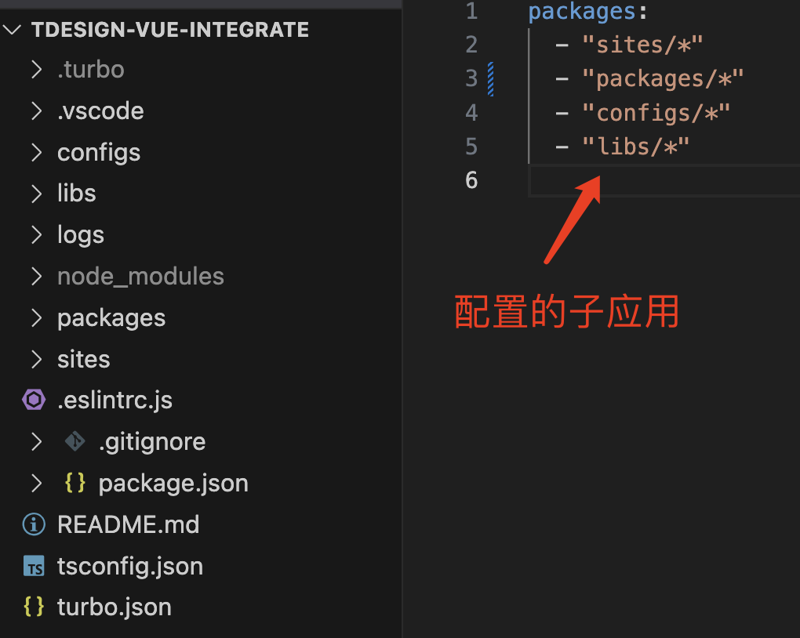
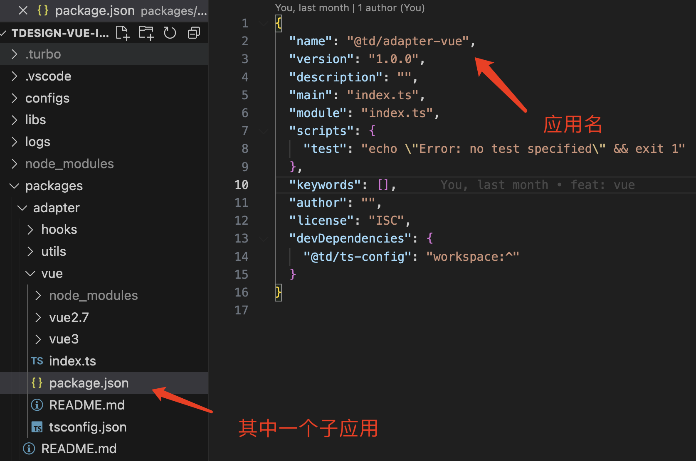

# 简单介绍一下项目仓库模式

## 0. 前言
交代一下本文的几个关键词

- 应用：指要发布的项目或者要注册的 npm 包
- 仓库：指一个 git 仓库，里面可能包含多个应用

## 1. 单个应用
直接使用 git 仓库即可

## 2. 多个应用
此时有多种选择

- 分成多个仓库
  - 仓库之间没有直接交集，可以 npm 包的形式存在间接交集
  - 仓库之间以 submodule 的模式存在直接交集
- 一个仓库容纳多个应用
  - 典型的 monorepo，以包管理器的 workspace 为基石

这里细细聊聊这几种选择。

### 2.1 分成多个仓库
多个仓库，也就是每一个应用一个单独的 git 仓库。

#### 2.1.1 仓库之间没有直接交集，以 npm 包的形式存在间接交集
分成多个仓库，仓库与仓库之间没有直接交集，要想共享代码，用 npm 包的形式，这个不用解释了，非常简单，也是最为古老的模式了。

优势：
- 每个仓库提交 commit 清晰
- 每个仓库代码量小、扩张速度慢

劣势：
- 共享代码困难
- 配置文件重复（包括项目 lint 配置、dev 配置、打包配置、env 配置等等）
- 依赖管理：可能需要额外的工具来处理跨仓库的依赖，每个仓库的构建和测试配置也可能需要单独维护
- 协作和集成的复杂性：协作和集成可能会更复杂，涉及多个仓库的改动可能需要多个提交和代码审查

#### 2.1.2 仓库之间以 submodule 的模式存在直接交集

这个也不难，就是说每一个应用还是单独的仓库，但是呢？现在共享代码不走 npm 包了，而是以 submodule 的模式。
> git submodule 是一种用于组织和管理 Git 多仓库项目的机制。它允许你在一个 Git 仓库中作为子模块添加另一个 Git 仓库。

因为仍然是一个个的仓库，所以 2.1.1 的优势依旧存在，除此之外，还有一些额外的优势。

优势：
- 开发效率相比较 2.1.1 的模式会更快（为啥呢？因为 submodule 仓库直接在一个项目中）
- 共享代码相比较 2.1.1 的模式会更容易（npm 包需要更新版本，submodule 只需要会更新 id 即可）

同样因为是一个个的仓库，所以 2.1.1 的劣势依旧存在，当然，第 1 点稍微减轻了一些
劣势：
- 共享代码依旧有些困难（submodule 提交 -> git 更新 id -> 提交，项目越多越繁琐）

> ant-design 和 tdesign 前期均是采用的这种方式。所以视情况而定，为什么 tdesign 要采用 submodule 的模式呢？需要多个仓库 + 代码共享的时候这就是一个很好的选择
> 后面方案比较的时候我再来详细聊吧

### 2.2 一个仓库容纳多个应用
典型的 monorepo，以包管理器的 workspace 为基石实现一个仓库中承载多个应用。

这个可能不是很清楚哈，我给个图来看看大致过程吧。

  
  
workspace 配置的子应用

  
  
其中一个子应用

  
  
另一个子应用通过 workspace 安装子应用

  
  
使用

相信你有了个大概的了解了吧。

再来看看其优劣势：

优势：
- **代码共享和重用**：所有项目和库都在同一个仓库里，方便进行代码共享和重用，直接 workspace 安装即可。
- **一致性**：统一的构建和测试工具，统一的依赖管理，能够减少每个项目的配置负担，提高一致性。
- **原子提交**：一次提交可以跨越多个项目，这在需要同时修改多个模块的场景下十分有用。

劣势：
- **规模扩大的挑战**：随着项目规模的扩大，代码库容易变得臃肿，代码的组织、管理和定位变得复杂。可能需要更强大的CI/CD和源代码管理工具来应对。
- **变动的影响范围**：一个模块的变动可能引起整个库需要重新测试，增加了维护成本。
- **权限和安全**：如果没有合理的访问控制和权限管理策略，难以控制对特定代码和资料的访问。

## 3. 闲聊

### 3.1 为什么大家这么推崇 monorepo？

在这之前，先聊一个问题：monorepo 依赖了 workspace 基础，请问 workspace 是什么，是谁提供的能力？

为什么大家这么推崇 monorepo 呢？个人观点：**因为不仅能实现多应用共存、还能究极方便地共享代码**，这两点真的很香。

### 3.1 为什么 tdesign 到目前还是用的 submodule 模式呢？

这就要谈为什么一开始 tdesign 最开始为什么要用 submodule 模式了，到底解决了什么问题。

在一开始，tdesign 包含 vue react mini program，每一个栈下设计是完全一致的，那么就需要统一的 css token、theme、layout，就那 css token 来说吧，这个就需要在所有栈下复用，那要怎么样才能做到所有栈下复用呢？可以选 npm 包，但这样复用效率太低了，加之这个共用的东西是我们能够控制的，所以选择了 submodule，在每一个栈下都引入 common 这个仓库，这个仓库就包含了上述所说的要共用的东西。

那为什么到现在还在用呢？为什么不改成 monorepo 的模式呢？很简单，因为各个栈就是必须要单独仓库，不能放在同一个仓库下，所以 submodule 还在用？

tdesign submodule 模式会一直存在吗？就目前来看，会的，只要多个栈必须单独仓库，这种模式就一直会存在。

### 3.2 monorepo + submodule 会不会有点扯。

说实话，一开始我也觉得有点扯，但真正明白了就完全不觉得了。

monorepo 到底为了个啥？就我说呀，**就是为了在多应用下实现完美的代码复用**。

submodule 是为了个啥？**是为了在多仓库下实现较好地代码复用**

所以，monorepo + submodule 是为了在**多仓库 + 多应用下实现更好地代码复用**
