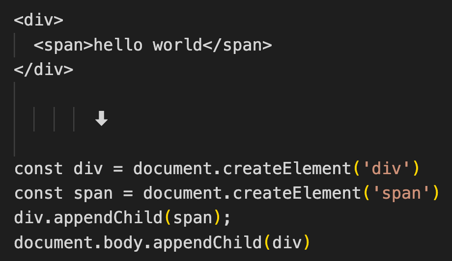

# 框架设计到处都体现着权衡的艺术

## 1. 命令式和声明式

从范式的角度，视图层框架通常分为命令式和声明式，具体怎么理解呢，假设要实现以下的功能：

```
- 获取 id 为 app 的 div
- 它的文本内容为 hello world
- 给它绑定点击事件
- 点击时提示 ok
```

1. 命令式

   如果使用原生的 js 来实现，大致的代码如下

   ```js
   const div = document.getElementById('app');	// 获取
   div.innerText = 'hello world'; // 文本内容
   div.addEventListener('click', () => { alert('ok') });	// 设置点击事件
   ```

   可以看到，自然语言描述能够与 js 代码产生一一对应的关系，代码本身描述的就是“做事的过程”，这种范式就是命令式，**命令式最大的特点就是关注过程**。

2. 声明式

   如果使用 vue 来实现呢，大致如下

   ```vue
   <div @click="() => alert('ok')">hello world</div>
   ```

   可以看到，这段代码直接声明了期望的结果，这种范式就是声明式，声明式最大的特点就是**更加关注结果**。至于实现这个结果的过程，则是内部实现的，比如这里的结果，则是由 vue 来帮我们完成的。

   >  vue 封装了**过程**，那么可以知道的是 vue **内部一定是命令式**的，只是**暴露给用户使用的是声明式的**。

## 2. 性能与可维护性的权衡

框架应该使用命令式和声明式呢？

熟知的 jQuery 是命令式，vue 是声明式的？为什么 vue 要声明式呢？

主要是在性能和可维护性上做权衡，这里先抛出一个结论：**声明式代码的性能不会优于命令式代码**

因为，声明式代码最终仍然是转换为命令式代码执行的。vue 最终也会转为命令式的 js 代码去执行的。

那为什么 vue 仍然采用声明式呢？

- 虽然命令式代码在理论上性能优于声明式，但要想写出绝对优化的命令式代码太难，所带来的的心智负担非常大。
- 即便是写出了绝对优化的命令式代码，后续的维护也是非常难的

因此，vue 选择了声明式，vue 要做的就是：**在保持可维护性的同时让性能损失最小**

## 3. 虚拟 DOM 

如何在保持可维护性的同时让性能损失最小呢？

## 4. 运行时和编译时

设计一个框架一般有三种选择：纯运行时的，纯编译时的以及编译时+运行时，那这时候该如何选择呢，vue 又为何选择了 "编译时+运行时" 呢？

假设要实现下面这段代码

```html
<div>
  <span>hello world</span>
</div>
```

我们分别来看看三种方式是怎么实现的。

1. 纯运行时

   假设框架为用户提供了一个 `Render` 函数，这个函数接收一个树形结构的数据对象，然后 `Render` 函数会根据对象递归地将数据渲染成 DOM 元素。

   规定数据对象如下

   ```js
   const obj = {
     tag: "div",
     children: [
       { tag: "span", children: 'hello world' },
     ]
   }
   ```

   每个对象有两个属性： tag 代表标签名称，children 既可以是一个数据（代表字节点），也可以直接是一段文本（代表文本）。然后框架提供的 `Render` 函数如下：

   ```js
   function Render(obj, root) {
     const el = document.createElement(obj.tag);
     if (typeof obj.children === "string") {
       const text = document.createTextNode(obj.children);
       el.appendChild(text);
     } else if (obj.children) {
       obj.children.forEach((child) => Render(child, el));
     }
   
     root.appendChild(el);
   }
   ```

   用户可以直接调用这个函数将 `obj` 渲染到 `body` 下：

   ```js
   Render(obj, document.body)
   ```

   这样，只要用户提供了属性结构，然后调用 `Render` 函数，就可以实现对应的功能，完全不涉及到编译，**这就是纯运行时的。**

2. 运行时 + 编译时

   从纯运行时可以看到，虽然框架提供了 `Render` 函数，但仍然需要用户编写一个树形的结构，这个树形结构很不方便，如果能够直接写类型 HTML 标签就好了，可以单纯的只提供了 `Render` 函数显然是不行的。

   那这时候为了满足这个需求，就开始思考，能不能引入编译的手段呢，什么意思呢，就是把用户编写的类似 HTML 的标签编译成所需要的树形结构，这样用户就不需要去写这个结构了，思路如下：

   <div align='center'>
   	
   </div>

   怎么做呢，就是框架为用户提供了一个  `Compiler` 函数，专门用于将 HTML 字符串编译成树形结构。

   ```js
   const html = `
     <div>
       <span>hello world</span>
     </div>
   `;
   
   const obj = Compiler(html);
   Render(obj, document.body);
   ```

   这里我们是纯运行时使用了`Compiler` ，当然，也可以直接在编译阶段执行 `Compiler`  函数的，这样就实现了编译时 + 运行时。

3. 纯编译时

   既然可以用 `Compiler`  将 HTML 字符串编译成树形结构，为什么不试着将 HTML 字符串编译成直接运行的 js 呢？如下：

   <div align='center'>
   	
   </div>

   这样就仅仅需要一个 `Compiler` 函数就够了，`Render` 函数都不需要了。这样就是纯编译时了。

那三种方式格式有什么优劣呢？

- 纯运行时，由于没有编译的过程，无法分析用户提供的内容
- 加入编译，可以分析用户提供的内容，分析哪些内容未来可能会发生变化，哪些永远不会
- 纯编译时的性能其实是最好的，但这种做法有损灵活性，用户必须编译后才能运行。而运行时+编译时的既可以用与编译+运行，也可以用于纯运行

业内对三种都有探索，比如 Svelte 就是纯编译时的框架。vue3 是编译时+运行时的框架。