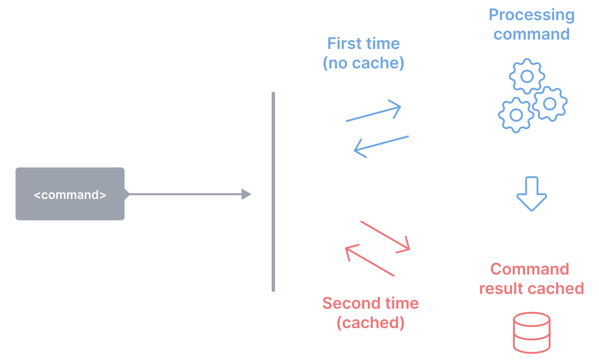
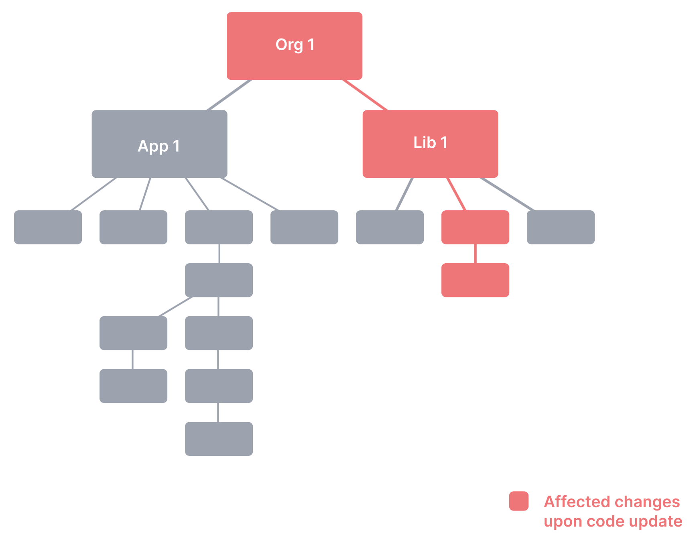

# Monorepo

> 译为单仓

本文将介绍你所需要了解的关于 Monorepo 的一切，以及业界构建 Monorepo 的工具。

## 1. 前言

Monorepo 现在可谓是相当的热门，尤其是在 Web 开发者中。

本文的目的就是为了帮助开发人员了解 Monorepo 是什么，它具有哪些优势，能带来什么好处，以及详细介绍业界能够便捷和高效的构建 Monorepo 的工具。

业界已经有许多优秀的 Monorepo 工具，这些工具分别由不同的团队打造，具有不同的理念。本文将尽最大努力来客观地阐述每种工具，如果有任何的错误，欢迎指出！

## 2. Monorepo

### 2.1 它是什么？

**Monorepo 是指包含多个不同项目的单个仓库，且这些项目之间具有良好的关系。**

总览业界稳定运行的 Monorepo 工具，这应是对 Monorepo 最一致、最准确的陈述。

### 2.2 为什么要使用 Monorepo

相信在使用之前，大家都会思考这个问题 —— 我为什么要用 Monorepo 呢？

通常大家谈论到上面这个问题 时，大家会想到这两个词吧：

1. Polyrepo —— 现在好好的单仓，为什么要改呢？
2. Monolith —— 所有项目都放到一个仓库里，岂不是很快就演变成巨石了？

下面呢，我们就先来聊聊这两个词吧！

#### 2.2.1 Polyrepo

Polyrepo 是当前开发应用的常用模式：每个团队、每个应用或每个项目都有各自的仓库，每个仓库都配备了所需的构建配置、环境以及流水线。

行业常用 Polyrepo 这种开发模式有一个重要原因：团队能够高度自治。例如，团队可以自主决定使用何种第三方库，何种方式以及何时部署和发布自己的应用，还有谁可以向仓库贡献代码以及使用这些代码。

这种高度自治是由仓库隔离所带来的，从团队的角度来看，是的，这些都是好事；但从宏观来看，这种隔离会损害团队之间的协作，来看看吧：

1. 繁琐的代码共享过程

   要跨仓共享代码，通常的做法是为期望共享的代码创建一个新的仓库，新的仓库必然需要对应的工具和 CI、代码共享规范以及打包发布，这样其它仓库才可以去使用它，代码才得以共享。除此之外，其它仓库在引用这些代码还需要考虑是否需要处理与这个仓库所不兼容的三方库等等。

2. 大量的重复代码

   除了专门建设公共设施的团队外，几乎不会有团队想要去单独新建和维护一个用于代码共享的仓库，因为相较于维护一个这样的仓库，直接在自己的仓库中去实现这些公共服务和组件反而更简单。但这样做不仅会浪费前期搭建项目的时间，而且，随着公共组件和服务的增加和变化，还会增加项目维护的成本、降低项目的安全性以及增大质量控制的难度。

3. 共享仓库的变更为多方带来的高额成本

   如果共享仓库中发生了一个严重的错误或者破坏性的升级：依赖此仓库的所有项目均需要对此依赖包进行升级、重新开发或测试以及重新构建打包发布才能真正生效。更不用说这个仓库本身的版本控制和发布软件包的一系列工作了。

4. 不一致的工具

   每个项目组或者团队都会偏向于使用自己的一组命令来运行测试、构建、本地开发、语法检查以及部署等等。这些的不一致性将会增加开发者在多项目之间切换时使用的心智负担。

   

	

那 Monorepo 能很好的解决这些问题吗？不要着急，往下看。

#### 2.2.2 Monolith

Monorepo 将所有项目都集中到了一个仓库中，的确，如果没有良好的项目关系和开发规范，真的很容易成为巨石，而且 Monorepo 成长为巨石的速度将比普通的 Polyrepo 快得太多。

那还要用 Monorepo 吗？岂不是自讨苦吃，哎，别着急，这才刚开始。

### 2.3 Monorepo 能带来什么？

如 2.2.1 所述，在使用 Polyrepo 工作时，我们可能会遇到一些非常棘手的情况。那 Monorepo 是否解决这些问题呢？答案是肯定的：

1. 良好的代码共享

   所有项目在同一个仓库中，自然，代码的共享会相当的简单，但如何合理的共享呢，就需要工具来支持了。

2. 零开销的新项目创建

   所有的项目以及使用者都在同一个仓库中，则无需重复设置新项目所需要的一切配套。

3. 跨项目的原子提交

   由于只存在一个仓库，那么当更新时，可以保证所有依赖项都得到对应的更新，就不再存在所谓的破坏性升级了，即某个公共服务更新时，可以由更新者处理仓库中所有依赖此服务的代码。

4. 版本控制

   无需担心多个项目在使用第三方库时发生版本冲突，因为只会存在一个版本。

5. 开发便利且鲁棒

   利用工具实现完备的自动化测试，如此，开发者可以毫无顾虑的去为团队里的任意一个应用贡献代码，因为只要完整地通过了测试，就能保证这些更改是安全的。

的确，当所有项目都集中到一个仓库时，会得到非常多的收益，**但更大的问题是，要如何才能搭建一个 开发敏捷、结构清晰并且易于管理的 Monorepo 呢？**这个吧，简单，要知道，社区里的那些大佬程序猿可不是吃干饭的，他们早早的就做了研究，实现了对应工具，比如 Lerna 、Bazel，下面我们就来看看这些工具吧。

## 3. 搭建 Monorepo 的工具

本文关注的 Monorepo 工具有：Bazel（Google 出品）、Gradle Build Tool（Gradle 出品）、Lage（Microsoft 出品）、Lerna、Nx（Nrwl 出品）、Rush（Microsoft 出品）和 Turborepo（Vercel 出品）。

> 选择依据：在 Web 开发社区中的受欢迎程度。

正如 2.3 所述，期望的是能够搭建一个开发敏捷、结构清晰并且易于管理的 Monorepo，那么**何谓开发敏捷、何谓结构清晰易于管理呢**？到底支持什么特性呢？结合业界的工具，本节将：

1. 首先介绍 ”开发敏捷、结构清晰并且易于管理” 的具体内容
2. 然后依据这些具体的特性对各个工具做一个对比

### 3.1 三大特性具体内容

#### 3.1.1 开发敏捷

1. 本地构建缓存

   支持缓存已构建或已测试过的文件，即：在同一台设备上，永远不需要构建或测试同一个文件两次。

   > 同一个文件：指这个文件未发生任何更改

   

   	
   

2. 本地多任务并行

   在保证各任务正确执行顺序的条件下，支持多任务并行。

   

   	
   

   

3. 分布式构建缓存

   支持共享缓存已构建或已测试过的文件，即：整个团队乃至代理团队都无需都同一个文件进行两次构建或测试

   

   	
   

   

4. 分布式任务执行

   支持分布式的执行任务，将各个子任务分发到多台机器上执行。

   

   	
   

5. 便捷远程执行

   支持在本地开发的同时在多台机器上执行任何命令。

6. 检测受影响的项目/包

   支持检测代码或文件更改可能会影响的内容，以便仅运行受影响的构建和测试。

   

   	
   

#### 

#### 3.1.2 结构清晰

1. 工作空间分析

   支持快速分析当前工作区的项目结构并查看。

   

   	
   

2. 依赖关系图可视化

   支持项目之间或任务之间依赖关系的可视化，并且支持可交互，意味着可以搜索、过滤、隐藏、聚焦图形中的节点。

   

   

   	
   

   

#### 3.1.3 易于管理

1. 源代码共享

   共享可复用的代码

   

   	
   

2. 一致的工具

   不论使用什么来开发项目：不同的 js 框架、Go、Rust、Java等等。工具均提供一致的体验。    
   例如：工具可以分析 package.json 和 js/ts 文件来分析项目的依赖以及构建和测试项目；可以分析 toml 文件对 Rust 项目执行相同的操作；同样支持分析 Gradle 文件对 Java 执行相同的操作。

   

   	
   

3. 代码生成

   支持代码的快速生成，如项目结构和基础配置的自动生成。

   

   

   	
   

4. 项目权限管理

   支持定义项目级、文件级的依赖、查看及修改等权限以及定义项目标识。例如，团队管理员可以将一些项目标记为其团队的私有项目，这样其他项目便不能依赖它们；除此之外，团队还可以根据使用的技术（例如React 或 Nest.js）标记项目，以确保后端项目不会引用前端项目。

   

   	
   

以上的所有功能都非常的重要，比如，对分布式任务执行的支持，这可能将改变整个开发生态，尤其是在超大型的 Monorepo 中。但除了以上的功能外，还有更多的更主观的，比如良好开发体验、快速的编写文档等等。在这里就不做过多的讨论了。

### 3.2 工具比较

3.1 描述了各个特性的具体内容，而社区中的工具并不都能完美的支持，各有偏重，大致如下。可以根据需求来决定哪些工具最为适合。

- Bazel —— 一个快速、灵活、可扩展且支持多语言的构建系统。

- Gradle —— 一个为多项目构建而设计的快速、灵活的多语言构建系统

- Lage ——  JS Monorepo 中的任务运行程序

- Lerna —— 一个用于管理多包 JavaScript 项目的工具

- Nx —— 下一代构建系统，提供一流的 Monorepo 支持

- Rush ——  适合拥有大量团队和项目的 Monorepo

- Turborepo —— JavaScript 和 TypeScript 代码库的高性能构建系统

<h4 style="text-align: center">各工具特性支持表</h4>
<table>
	<tr>
	    <th>特性</th>
    	<th>特性</th>
	    <th colspan="7" style="text-align: center">工具</th>  
	</tr >
  <tr>
	    <td>-</td>
    	<td>-</td>
	    <td>Bazel</td>
 	    <td>Gradle</td>
    	<td>Lage</td>
    	<td>Lerna</td>
    	<td>Nx</td>
    	<td>Rush</td>
    	<td>Turborepo</td>
	</tr >
	<tr >
	    <td rowspan="6">开发敏捷</td>
	    <td>本地多任务并行</td>
	    <td>✅</td>
      <td>✅</td>
      <td>✅</td>
      <td>⛔</td>
      <td>✅</td>
      <td>✅</td>
      <td>✅</td>
	</tr>
	<tr>
	    <td>本地构建缓存</td>
    	<td>✅</td>
      <td>✅</td>
      <td>✅</td>
      <td>✅</td>
      <td>✅</td>
      <td>✅</td>
      <td>✅</td>
	</tr>
	<tr>
	    <td>分布式构建缓存</td>
	    <td>✅</td>
      <td>✅</td>
      <td>✅</td>
      <td>⛔</td>
      <td>✅</td>
      <td>✅</td>
      <td>✅</td>
	</tr>
	<tr>
	    <td >分布式任务执行</td>
	   	<td>✅</td>
      <td>✴️</td>
      <td>⛔</td>
      <td>⛔</td>
      <td>✅</td>
      <td>✴️</td>
      <td>⛔</td>
	</tr>
	<tr>
	    <td >便捷远程执行</td>
	    <td>✅</td>
      <td>⛔</td>
      <td>⛔</td>
      <td>⛔</td>
      <td>⛔</td>
      <td>⛔</td>
      <td>⛔</td>
	</tr>
  <tr>
	    <td >检测受影响的项目/包</td>
	    <td>✴️</td>
      <td>✅</td>
      <td>✅</td>
      <td>✅</td>
      <td>✅</td>
      <td>✅</td>
      <td>✅</td>
	</tr>
  <tr >
	    <td rowspan="2">结构清晰</td>
	    <td>工作空间分析</td>
	    <td>✴️</td>
      <td>✅</td>
      <td>✅</td>
      <td>✅</td>
      <td>✅</td>
      <td>✅</td>
      <td>✅</td>
	</tr>
  <tr>
	    <td >依赖关系图可视化</td>
	    <td>✅</td>
      <td>✴️</td>
      <td>✴️</td>
      <td>✴️</td>
      <td>✅</td>
      <td>✴️</td>
      <td>✅</td>
	</tr>
  <tr >
	    <td rowspan="4">易于管理</td>
	    <td>源代码共享</td>
	    <td>✅</td>
      <td>✅</td>
      <td>✅</td>
      <td>✅</td>
      <td>✅</td>
      <td>✅</td>
      <td>✅</td>
	</tr>
  <tr>
	    <td >一致的工具</td>
	    <td>✅</td>
      <td>✅</td>
      <td>⛔</td>
      <td>⛔</td>
      <td>✅</td>
      <td>⛔</td>
      <td>⛔</td>
	</tr>
  <tr>
	    <td >代码生成</td>
	    <td>✴️</td>
      <td>✴️</td>
      <td>✴️</td>
      <td>✴️</td>
      <td>✅</td>
      <td>✴️</td>
      <td>✴️</td>
	</tr>
  <tr>
	    <td >项目权限管理</td>
	    <td>✅</td>
      <td>✴️</td>
      <td>✴️</td>
      <td>✴️</td>
      <td>✅</td>
      <td>✅</td>
      <td>✴️</td>
	</tr>
</table>

- ✅：工具原生支持
- ✴️：工具原生不支持，但支持自己实现
- ⛔：完全不支持

## 4. 资源

1. 视频

   - [Monorepos - How the Pros Scale Huge Software Projects](https://www.youtube.com/watch?v=9iU_IE6vnJ8&utm_source=monorepo.tools)

   - [Nx: Google-level Monorepo Tools for Everyone - Jeff Cross and Victor Savkin](https://www.youtube.com/watch?v=eZQ_jWaTCVM&utm_source=monorepo.tools)

   - [Turborepo Demo and Walkthrough (High-Performance Monorepos)](https://www.youtube.com/watch?v=YX5yoApjI3M&utm_source=monorepo.tools)

   - [Monorepos: Any Size Fits All, by Altan Stalker](https://www.youtube.com/watch?v=elKsZvowdok&utm_source=monorepo.tools)

   - [BazelCon 2021 (Playlist)](https://www.youtube.com/watch?v=7M9c6x3WgIQ&list=PLxNYxgaZ8Rsc3auKhtfIB4qXAYf7whEux&utm_source=monorepo.tools)

   - [NxConf 2021 (Playlist)](https://www.youtube.com/watch?v=VKVTzVM0nVM&list=PLakNactNC1dG1CoyVWFppw3X8hnXRhFuy&utm_source=monorepo.tools)

2. 文章
   - [The One Version Rule – opensource.google](https://opensource.google/docs/thirdparty/oneversion?utm_source=monorepo.tools)
   - [Why TurboRepo Will Be The First Big Trend of 2022](https://dev.to/swyx/why-turborepo-will-be-the-first-big-trend-of-2022-4gfj?utm_source=monorepo.tools)
   - [Build Monorepos, not Monoliths](https://dev.to/agentender/build-monorepos-not-monoliths-4gbc?utm_source=monorepo.tools)
   - [Lerna/Yarn -> Nx: Faster Build Times + Better Dev Ergonomics](https://dev.to/nx/lerna-yarn-nx-faster-build-times-better-dev-ergonomics-32a6?utm_source=monorepo.tools)
   - [Nx monorepo documentation](https://nx.dev/guides/why-monorepos#monorepos?utm_source=monorepo.tools)

## 5. 总结

记得当时有个讨论，选大仓还是小仓，其中有句话我记忆犹新：

“如果没有良好的复用机制、完善的流程和规范和完备的单元测试，所谓的大仓，只能是一大堆垃圾山”。

的确是的，在没有完备的基建条件下使用大仓，带来的一定是灾难。但，只要做到了这些，那么，起飞。

## 6. 文章说明

本文大部分内容来源于 [monorepo.tools](https://monorepo.tools/)，只是对文章做了意译和整理，感兴趣的同学可以直接看原文。

