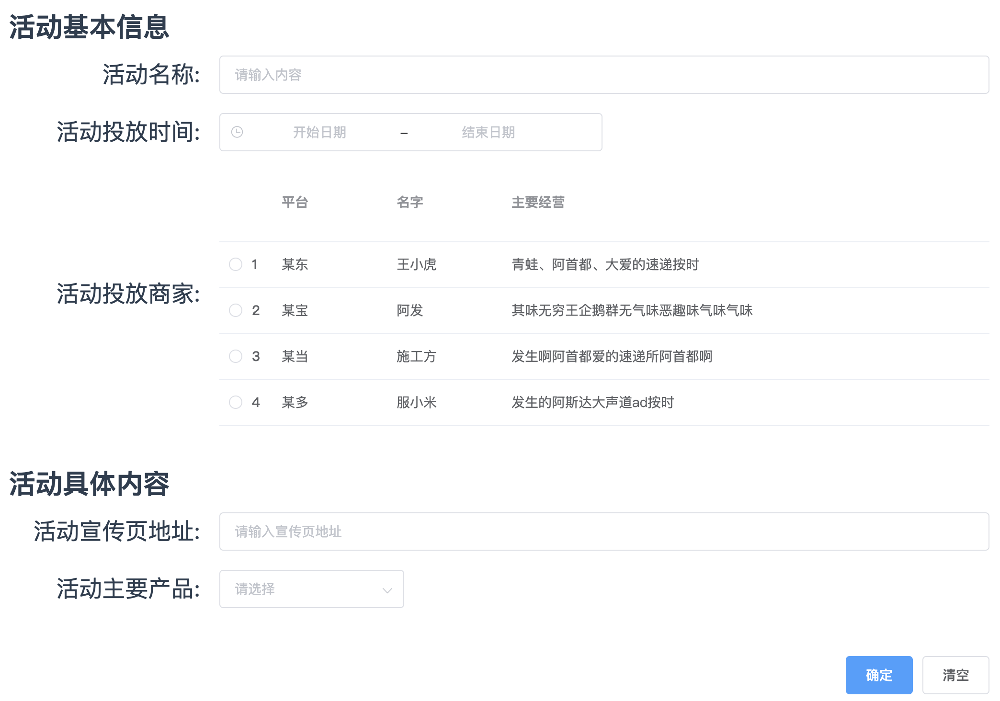
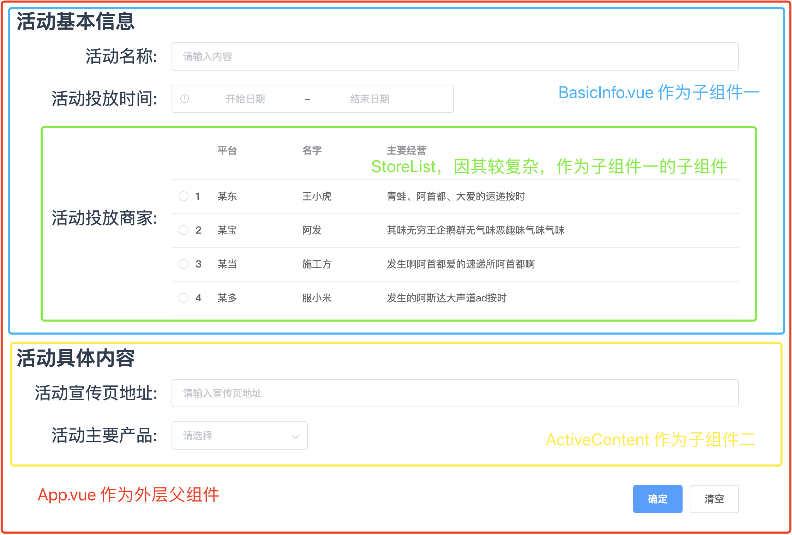
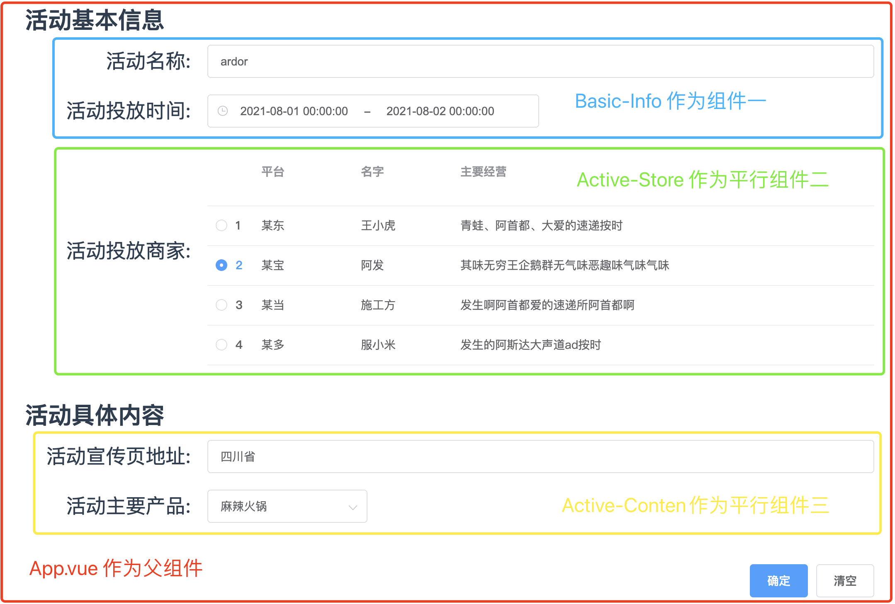

[toc]

# 谈谈如何”正确“的使用 Vuex

> 阅读本文需要你对 vuex 或 redux 等全局状态管理技术有一定的了解、最好是中大型项目的开发及维护经验！！因为这样才能感同身受！！
>
> vuex、redux 技术的思想是一致的，因此本文提到的API、图片、示例等都以 vuex 为演示， redux 只有些许的不同。

摘要：vuex 等全局状态管理技术的主要目的是集中式的存储管理状态(数据)，并以相应的规则保证状态以一种可预测的方式发生变化。状态定义(`state.xx`)、状态获取(`store.state.xx`)以及状态更改（异`action`同`commit`步） ，简单的几个 API 使得我们在多层级、多数量组件之间实现状态共享异常的轻松。但如果你曾维护过大型项目并且其中大量使用 vuex 进行状态管理，相信你曾遇到过因不知道某个状态是在哪一个组件初始化、哪一个组件更新而不得不逐个检查的困境，可项目中的确又需要这样的状态管理，那么如何”正确“的使用 Vuex 便成了本文的主题。


## 1. 前言

项目的开发难免会遇到需要状态共享的需求，例如用户信息，因此使用 vuex 等**全局状态管理**技术**是必不可少**的。vuex 等集中式管理状态的思想为项目共享全局状态带来了极大的便利，简单的几个 API 就能轻易实现，初始化 (`state、mutations、actions`)、获取 (`store.state.xx`)、同步修改 (`store.commit`)以及异步修改(`store.dispatch`)。

在**开发**的过程中使用 vuex ，数据流是十分清晰的，如下图所示，数据在 `state` 中注册，在视图中展示，然后通过异步或者同步的方法进行更新，更新后的数据又会作用于（重渲染）到视图中。


**开发的过程中**的确简单易用且清晰，既然这么好，那么是不是就可以随时随地想用就用呢？答案是否定的，的确，项目前期开发的时候想怎么用就怎么用都行，因为数据量小且数据流清晰，你能轻易的掌控你所共享的数据——因为共享的数据由你在 `state` 中注册，同时也是由你在视图中展示以及由你编写驱动状态更新的事件(函数)，整个创建更新的过程你都知晓，**可是一旦随意使用甚至滥用 vuex，将会造成以下三个严重的问题**：

1. **数据流转不清晰，**当共享数据量过多时，比如你同时共享了数十个数据，以及这数十个数据均在多个组件中共享且更新，那么你是否能准确的理清楚这些数据的流转呢？如某个数据在什么时候赋于的初始值，什么时候更新的？哪怕你现在能理清楚，那十天之后呢？因为状态在多组件中共享，会导致你无法快速的定位状态的初始更新等操作，你也就无法快速的迭代。
2. **带来极大的维护灾难**，项目需要更新迭代时，新的维护人员对这些数据的流转是毫不知情的，他想要知道某个状态何时何地被首次赋值的，那么他可能需要找到对应状态的  `commit`  方法，然后**全局搜索**这个方法，**结果发现有十个组件都使用了这个方法，**然后他便需要**逐个检查**才能知道何时何地被首次赋值的，可是这时他发现，直接从 `state`  中获取的值不是刚刚他看到的那个被首次赋值的结果，应该是在某个组件里又被重新更新了一次，因此，为了知道是在哪个组件又被更新的，他又需要再次逐个检查。维护人员需要逐个查看 `commit` 方法调用的触发时机和结果，否者他将无法知道目前状态是在何时何地更新的、或者他将增加或删除的数据又会何时何地影响到何组件，共享的数据量愈多或者更新方法 `commmit` 愈多次被调用时，**维护灾难就愈发严重**。
3. **高度耦合，无法复用**，组件内部一旦使用了全局共享的状态，那么这个组件就已经被高度耦合进了项目中。当项目中大量使用甚至滥用 vuex 时，在重构项目以实现组件复用时需要极其小心甚至还可能需要耗费大量的时间来进行重构。

**当然只要在项目中使用了 `Vuex` ，这三个问题都会不同程度的在项目中存在。**只是我们要做的是，在不得不使用 `Vuex` 的情况下尽量的做到**正确使用以最大程度的减少**负面的影响。

文字说明还是过于苍白，下面用一个实际的例子来展示上述提到的不”正确“ `vuex` 会造成的问题：

## 2. 不”正确“使用 Vuex 示例

> 需要说明的是，这里的不”正确“以及标题的不”正确“指的是不完全合理

示例是曾经博主在实际的项目维护中遇到的真实案例(脱敏后)，当然近期维护项目时也是遇到很多，可见不”正确“使用 `Vuex` 的现象是普遍存在的，所以才打算写出这篇文章。

### 2.1 场景描述

场景如下：配置（新增和编辑）商品活动详情：包括名称、投放时间、商家以及对应的宣传页和产品类型。真实的场景远远比这个复杂，包括大量的配置项和复杂逻辑，有的还需要多页才能完成配置，但是几乎大部分后台配置页都是如此，因此这里简化成这个原型，此原型也是从实际的业务中总结得出的，如下图。



### 2.2 实现分析和简单代码演示——使用 `Vuex`

#### 2.2.1 实现分析



如图所示的组件划分应该是最为简单、直接且一目了然的了。按照这样的组件划分且使用 `Vuex` 来共享全局的状态，下面进行代码的演示。

#### 2.2.2 代码演示

在 `Store` 注册全局状态以及更新的 `commit` 方法。

```js
export default {
  namespaced: true,
  state: {
    activeInfo: {
      key: value,		// 注册各字段
    }
  },
  mutations: {
    UPDATE_ACTIVE: (state, val) => {state.activeInfo = { ...state.activeInfo, ...val,	}}, // 更新 commit
    CLEAR_ACTIVE: (state) => { state.activeInfo = { key: value }},	// 清空
  },
};
```

`App.vue` 组件异步获取到活动数据（编辑时）并保存到全局状态，

```vue
// App.vue
<template>
  <div id="app">
    <basic-info />
    <active-content />
  </div>
</template>

<script>
  export default {
    created() {		// 编辑时异步获取活动数据并且保存到全局状态
      this.$store.commit('active/UPDATE_ACTIVE', { ...异步获取的活动数据 });
    },
  }
</script>
```

其它的组件自主从 `Store` 中获取数据以及更新时调用 `commit` 方法，所有的子组件都是同样的思路，因为都是从全局获取并且调用全局 `commit` 方法更新，因此写法都是一致的，就不再多赘述。

```vue
// BasicInfo.vue
<script>
export default {
  computed: {
    activeName:  {		
      get() {	return this.$store.state.active.activeInfo.activeName; },	// 从全局状态获取
      set(val) { this.$store.commit('active/UPDATE_ACTIVE', { activeName: val }); } // 调用 commit 方法更新
    },
    activeTime:  {
      get() { return this.$store.state.active.activeInfo.activeTime; },	// 从全局状态获取
      set(val) { this.$store.commit('active/UPDATE_ACTIVE', { activeTime: val, }); }	// 调用 commit 方法更新
    },
  },
};
</script>
```

完整的代码可以点击查看 [vuex-demo/src/views/version-1-vuex-nested](https://github.com/Ardor-Zhang/web-study-record/tree/master/%E9%9B%B6%E6%95%A3%E7%9A%84%E7%9F%A5%E8%AF%86%E7%82%B9/%E8%B0%88%E8%B0%88%E5%A6%82%E4%BD%95%E2%80%9D%E6%AD%A3%E7%A1%AE%E2%80%9C%E7%9A%84%E4%BD%BF%E7%94%A8Vuex/vuex-demo/src/views/version-1-vuex-nested)

### 2.3 问题分析

按照 [2.2](#2.2) 节的实现和代码组织，在初次开发过程中是相当顺利的和简单的，因为各组件只需要做两件事情：

1. 从全局状态获取状态
2. 调用 `commit` 方法更新状态

除此之外，不再需要考虑任何事情需求就能很好的实现。可是，等一段时间后需要添加某个功能，这个功能是要依赖于这个全局状态的，那么此时你便需要知道这个状态的流转过程是如何的，一般会按照以下步骤来查找：

1. 何时何地注册的？
2. **全局搜索** `commit` 方法查看何时何地初始化的？
3. **全局搜索** `commit` 方法查看何时何地更新的，并且确定此更新是否是新增功能的前置动作，如果是，状态相当于更新了两次，如果不是，那么查看下一个调用 `commit` 组件或方法？
4. **一直重复第 3 步直到你确定**此刻获取到的 `state` 的整个流转过程。

下图是  [2.2](#2.2) 节代码中包含的更新活动状态的 `commit` 方法，如此简单的一个功能，就包含了这么多的更新调用，**如果不逐一查看，维护的时候从何知晓这个状态究竟是在何时何地被赋值被更新的，当前这个状态又是经过了哪些更新得到的？**这里还是数据量小且字段清晰地场景，如果在更新的过程中不是直接传入的 `key: value` 而是一个 `Object`, 那么一步一步的查找的这个过程就会使得维护者丧失了耐心。这种不”正确“使用 `Vuex` 的所带来的维护成本将随着状态量和 `commit` 调用量的增加而成几何倍增加。


因此，如何”正确的“使用 `Vuex` 便成为了一个需要探讨的问题。


## 3. 如何正确的使用 Vuex

### 3.1 真的需要吗？

引用 `Redux` 的作者 Dan Abramov 的话来开始：

> Flux 架构就像眼镜：您自会知道什么时候需要它。

`Vuex` 思想因其全局共享状态的确能够带来很多便捷，但是项目或者需求真的需要它吗？让我们稍作思考，然后再动手吧！！

#### 3.1.1 从需求本身思考

当获取到一个需求时，开发者第一思考的不应该是如何用代码实现它，而是应该思考这个需求的合理性，思考这个问题不应该仅仅是产品这个角色的任务，抛开产品是不是只会站在他本身的立场去思考，更多的是他不会知道这个需求不同的设计会给开发带来不同的难度。

有的方案之下你可能不得不使用 `Vuex`，有的方案之下你就能很好的避免使用，也只有你才知道，或许换一种产品设计方案，带来将是意想不到的收获。因此开发者更应该思考，需求是否合理，是否有更好的设计以便既能满足需求同时还能更便于开发。

举一个小小的例子，虽然这个例子与 `Vuex` 没有太多的关系，但是能很好的说明思考需求的合理性带来的价值，这个例子也是博主遇到的实际需求(当然脱敏后的)。需求如下，新增一个活动需要选择活动对应的区域，最初的产品设为以下两图，使用一个级联下拉框选择省和市，还需要添加一个全部的选项。

**在不加思考的情况下**，你将会遇到以下问题：**当用户选择全部时**，你需要将所有的一级和二级的选项全部置为已勾选状态，**这样才符合全选的 UI 效果展示**，那么你就需要遍历所有的选项改变其状态，可想而知，你需要写一个庞大的函数来遍历

         

这是一个极其不合理的设计，是不是可以稍作思考，如果将需求设计成以下两图，会不会有恍然大悟的感受，将全部分离开来，这样不仅仅满足了在 UI 展示业务需求，同时极大的降低了代码实现难度。

                   

希望示例能做到抛砖引玉的效果。任何时候我们都应该去思考是不是存在更好的方案去满足我们的需求。结合到 `Vuex`，或许不假思索的方案你不得不使用它，但或许你稍加思考便可以避免呢，毕竟只要使用了 `Vuex`，不同程度的都会带来 [前言](#1. 前言) 中提到三个问题。

#### 3.1.2 从代码设计思考

> 代码设计和实现是两个方面，这里先讨论代码设计层面

在需求确定后，开发者此时思考的不应该是如何如代码写出来，而是如何设计代码以更合理的方式组织代码，如组件化，如组件组织的方式。

使用 `Vuex` 的场景其一就是**因为组件嵌套过深导致使用 `props` 传值的方式十分繁琐**，因此，这时候我们是否应该思考，**真的需要那么深的组件嵌套吗**，如果能将代码设计为仅仅是一层父子组件，是不是 `Vuex` 就不再需要了呢？是不是可以换一种思路，将深度嵌套的组件平铺化，下面就以 [2.1, 2.2](#2.1) 的场景作为示例，改变代码的设计，将嵌套组件改为同层级组件。



如果能够将深度嵌套的组件平铺化，想想，这时候我们还需要 `Vuex` 吗？是不是直接使用 `props` 就可以了呢？就算此时还想使用 `Vuex`, 至少同层的数据流转相比较嵌套流转在查看时更加容易和清晰了。

如何组织组件是一个需要长期思考的问题，在实现需求时，时刻问问自己，是不是可以不用深度嵌套，是不是可以将组件拆得更小以实现平行组件？

#### 3.1.3 从代码实现思考

在代码组织、设计上思考后，接下来就是实际码代码了吗？我认为不是的，还需要再思考代码到底要怎么写，一个功能的实现，就代码的编写来看，可有多种写法，例如子组件想要修改父组件的状态，可以选择子组件 `emit`  触发父组件在子组件上监听的事件，同样也可以选择直接执行父组件传给子组件的事件，不同的编写方案原理思想是不同的，那么带来的编写和维护成本也是不同的。

大的方面说，是选择面向对象的写法呢还是面向过程的写法？小的方面讲，是直接 `props` 传值就足够呢还是非用 `Vuex` 进行状态共享呢？正确的合理的选择代码编写将为直接影响技术选择，同样也直接影响着维护的成本。

同样下面以就拿 [2.1, 2.2](#2.1) 节中的需求来说，正如 [3.1.2 ](#3.1.2 ) 中谈到，当设计从嵌套组件改为同层级组件后，是否仍然需要 `Vuex` 呢？[3.1.2 ](#3.1.2 ) 节仍然选择的是使用 `Vuex`，下面就采用另一种思路，采用 `props` 传值的方式来实现以对比究竟怎么实现是更”正确的“呢？


### 3.2 更”正确“的使用

博主是一个饱受 `Vuex` 摧残的程序猿，工作期间一直与不”正确“使用甚至滥用 `Vuex` 的项目相爱相杀，以下是我在实践中总结出来的如何更"正确"的使用 `Vuex` 的经验。

首先，在使用 `Vuex` 之前， 我们应该问问自己以下两点：

1. 是不是已经思考再三，是不是有可能不需要使用`Vuex`(参考[3.1](#3.1))，是不是到了不得不使用 `Vuex` 的情况了；
2. 是不是已经权衡再三，虽然有其它的方案可以代替，但是其带来的负面效果(维护成本、逻辑关系)是高于 `Vuex` 的。

如果以上两点都已经思考过且得出结论是需要使用 `Vuex` 了，例如：用户的个人信息，那么这个时候再参考以下两点来使用 `Vuex` 以最大程度的减小维护的成本。

#### 3.2.1 减少全局更新状态

`Vuex` 带来的维护成本主要是因为数据流转不清晰，其根本原因是因为修改状态值的 `commit` 方法可以**在项目的任意地方**调用，维护项目查找此状态时不得不**全局搜索**查看每一个 `commit` 方法。

既然如此，那么我们在使用的过程中应当做到尽量只在一处或者最多两到三处更新状态，也就是调用 `commit`方法，其它地方只是获取来使用。

因为每减少一处更新调用，维护时就能更加容易明确数据的流转过程，那么维护时也就能更快的找到问题的出现时机或者更好的进行数据增删；而每多一处更新调用，状态的流转过程的复杂度就会成倍增加，维护人员需要逐个查看调用的触发时机和结果，否者他将无法知道目前状态是在何时何地更新的、或者他将增加或删除的数据又会何时何地影响到何组件，调用数量愈多，维护灾难就愈发严重。

#### 3.2.2 模块化

模块化其实并不能解决因多处调用 `commit` 方法更新状态所带来的维护灾难，因为调用时机和地点仍然不清楚，所以放到了最后。

但是模块化能够更好的组织代码，使得状态相对非模块化下更加清晰、组织起来更加简单，因为你把某一类的数据都封闭在了一个模块下，自然数据量相比较非模块下更小、针对性也更强了。

## 4. 总结

## 5. 感谢


