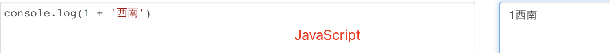
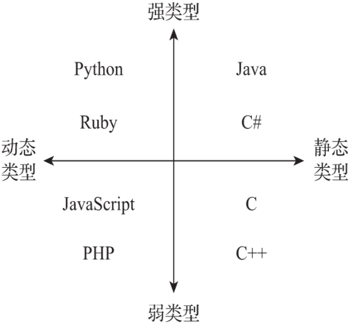

[toc]

# 静态类型 vs 动态类型 和 弱类型 vs 强类型

在描述一个程序语言时，一般会使用这两组术语：

1. 静态类型和动态类型
2. 弱类型和强类型 

那这两组术语具体的含义是什么呢？下面就来详细的聊一聊，以免在使用的时候混淆。

## 1. 静态类型和动态类型

静态类型与动态类型指的变量定义后，其类型是否还可以更改：

- 静态类型是变量的类型**绑定到变量声明**，在编译时检查类型
- 动态类型是变量的类型**绑定到变量值**，在运行时检查类型

1. 静态类型语言中，变量在声明时需要先声明其类型，也就是在变量创建的时候变量的类型就已经确定了，确定后不可更改，在使用过程中，仅能为其赋指定类型的值，若为其赋其它类型的值，会直接出错。

   

     
   

2. 动态类型语言中，变量在声明时不需要声明其类型，类型根据所赋的值决定，即为变量赋何种类型的变量，变量就是对应的类型。

   

     
   

常见的静态类型语言有：Java, C, C#, C++

常见的动态类型语言有：Python, Ruby, JavaScript, PHP

## 2. 弱类型和强类型 

强类型和弱类型是一个**在含义上并没有得到广泛统一的术语**，因此，讨论它并没有实际的意义，[维基百科](https://en.wikipedia.org/wiki/Strong_and_weak_typing#Static_type-checking)指出：由于术语并未得到统一的原因，希望明确地撰写有关类型系统的作者避开这组术语。

大多数使用这个术语来表示静态/动态类型以外的东西 —— 用它来解释语言的编译器是否会强制执行类型规则（但并非完全正确）。

- 强类型意味着编译器强制执行类型规则
- **弱类型**意味着编译器不强制执行类型规则，或者这种强制可以很容易地被破坏

这里以一种区分方案作为解释（**但并不完全正确，毕竟超级大佬们都没有统一这个术语的含义**）：

弱类型语言对于变量类型的检查比较宽松，容忍隐式类型转换的发生。隐式类型转换，也称为*强制*转换，是[编译器](https://en.wikipedia.org/wiki/Compiler)自动进行的类型转换，例如：在 JavaScript 中， Number 类型的数据和 String 类型的数据相加后的结果为 String 类型，在这个过程中， Number 类型的数据被隐式的转换成了String 类型；而在 Python 中，让一个  Number 类型的数据和 String 类型的数据相加便会报错。

  
  
JavaScript 中支持隐式转换

  
  
Python 中不支持隐式转换

根据这一概念定义来分类：

常见的强类型语言有：Python, Ruby, 

常见的弱类型语言有：JavaScript, PHP, C, C++

> 很多人把 C# , Java 也归为强类型，测试后发现 C# , Java 支持隐式转换的，所以按照这一概念来分类并不完全正确

## 3. 总结

关于静态和动态类型，这一组术语理解简单，因此分类上没有任何的问题。

关于强和弱类型，这一组术语本身含义并不统一，因此分类多少会存在歧义。

下图是一张常见的分类图，**但是在强和弱类型含义未统一的前提下，这并没有太强的说服力**，当然，静态和动态类型的分类是具有说服力的。

  
  
常见的分类（但并不完全正确）

## 4. 参考

1. [What is the difference between a strongly typed language and a statically typed language](https://stackoverflow.com/questions/2690544/what-is-the-difference-between-a-strongly-typed-language-and-a-statically-typed)

2. [Strong and weak typing](https://en.wikipedia.org/wiki/Strong_and_weak_typing#Static_type-checking)